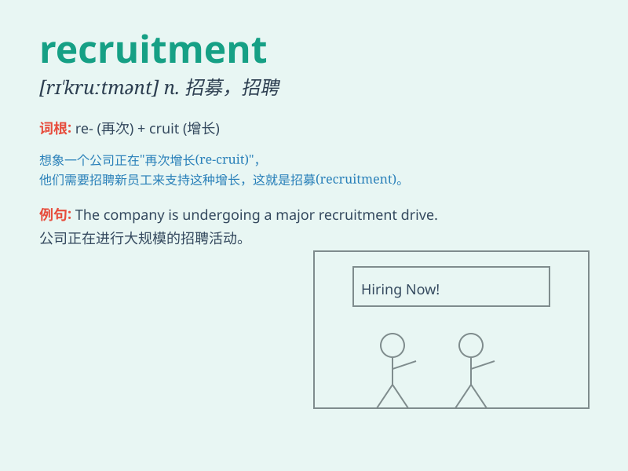

## recruitment

**英音:** _[rɪ\'kruːtm(ə)nt]_ **美音:** _[rɪ\'krʊtmənt]_

**译义:** *n.征募新兵,补充*

### 短语

+ **recruitment process:** _招聘流程_

+ **recruitment drive:** _招聘活动_

+ **recruitment agency:** _招聘机构_

+ **recruitment policy:** _招聘政策_

+ **recruitment fair:** _招聘会_

### 例句

#### 例句1

> **The recruitment process for this position is very
competitive.**

**中文翻译:** 该职位的招聘过程竞争非常激烈。

**单词释义:** 招聘；征募

#### 例句2

> **Our company has completed the recruitment of new staff.**

**中文翻译:** 我公司已完成新员工的招聘工作。

**单词释义:** 招聘；征募

#### 例句3

> **Recruitment agencies can help you find a suitable job.**

**中文翻译:** 招聘机构可以帮助您找到合适的工作。

**单词释义:** 招聘；征募

### 背诵小故事

> A company was in urgent need of new staff. They launched a big
recruitment drive, posting ads everywhere. Many people came for
interviews. Finally, they found the right ones. \'Recruitment\' is all
about finding and getting new people for a job or an organization.

**一家公司急需新员工。他们开展了大规模的招聘活动，到处张贴广告。很多人来面试。最终，他们找到了合适的人选。"recruitment"就是为一份工作或一个组织寻找并获得新人。**

### 图义

