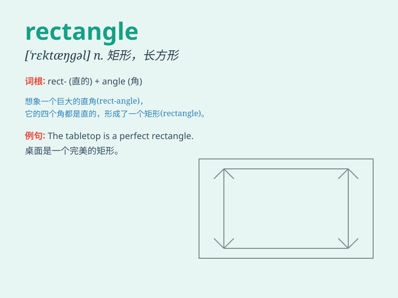

## rectangle

**英音:** _[\'rektæŋg(ə)l]_ **美音:** _[\'rɛktæŋɡl]_

**译义:** *n.长方形,矩形*

### 短语

+ **rectangle shape:** _矩形形状_

+ **draw a rectangle:** _画一个矩形_

+ **rectangle area:** _矩形面积_

+ **rectangle perimeter:** _矩形周长_

+ **inside the rectangle:** _在矩形内部_

### 例句

#### 例句1

> **The blackboard is a rectangle.**

**中文翻译:** 黑板是一个长方形。

**单词释义:** 长方形

#### 例句2

> **She drew a rectangle on the paper.**

**中文翻译:** 她在纸上画了一个矩形。

**单词释义:** 长方形

#### 例句3

> **The swimming pool is in the shape of a rectangle.**

**中文翻译:** 游泳池呈长方形。

**单词释义:** 长方形

### 背诵小故事

> Once upon a time, a little ant was lost in a big garden. It saw a
shape with four straight sides and four right angles. The ant called it
a \'rectangle\' and used it as a landmark to find its way home.

**从前，一只小蚂蚁在一个大花园里迷路了。它看到了一个有四条直边和四个直角的形状。蚂蚁称它为"矩形"，并把它当作地标找到了回家的路。**

### 图义

