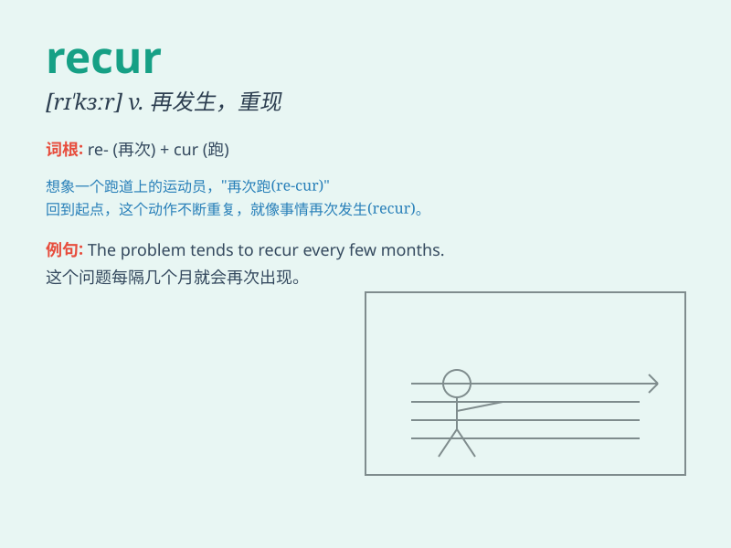

## recur

**英音:** _[rɪ\'kɜː]_ **美音:** _[rɪ\'kɝ]_

**译义:** *vi.复发,重现,再来*

### 短语

+ **recur frequently:** _频繁重现_

+ **recur periodically:** _周期性地重现_

+ **recur unexpectedly:** _意外地重现_

+ **recur constantly:** _不断地重现_

+ **recur intermittently:** _间歇性地重现_

### 例句

#### 例句1

> **The same problem keeps recurring in our project.**

**中文翻译:** 同样的问题在我们的项目中不断重复出现。

**单词释义:** 出现；重现

#### 例句2

> **Memories of my childhood often recur when I see those old
photos.**

**中文翻译:** 当我看到那些老照片时，我常常会想起童年的记忆。

**单词释义:** 重现；再次发生

#### 例句3

> **The disease may recur after several years of remission.**

**中文翻译:** 这种疾病在缓解几年后可能会复发。

**单词释义:** 复发；再次出现

### 背诵小故事

> 想象一个人总是做同一个噩梦，这个噩梦
recur（重现）。每次他刚要忘记，就又在睡梦中经历。就像疾病，好了又犯，这就是
recur ，不断重复出现的意思。

**想象一个人总是做同一个重现的噩梦。每次他刚要忘记，就又在睡梦中经历。就像疾病，好了又犯，这就是
recur ，不断重复出现的意思。**

### 图义

