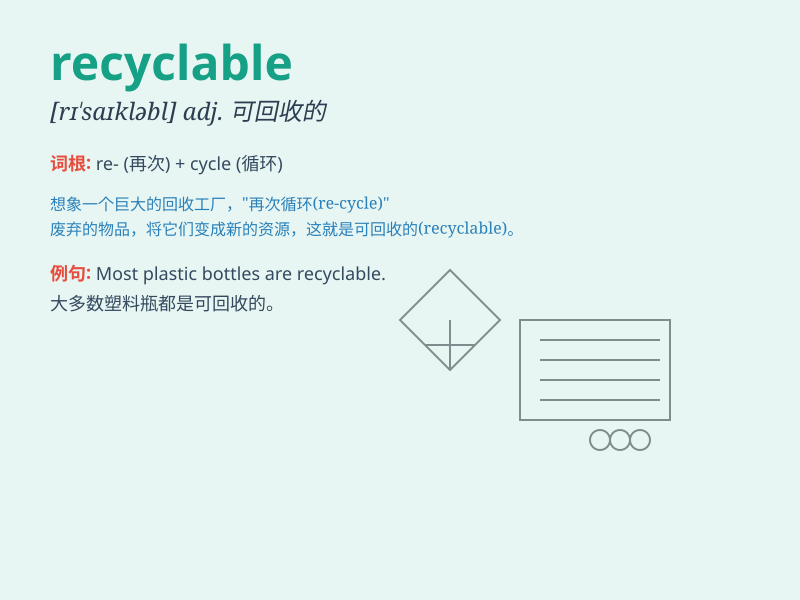

## recyclable

**英音:** _[ˌriːˈsaɪkləbl]_ **美音:** _[ˌriːˈsaɪkləbl]_

**译义:** *adj.可循环再用的，可回收的*

### 短语

+ **recyclable materials:** _可回收材料_

+ **recyclable packaging:** _可回收包装_

+ **recyclable waste:** _可回收废物_

+ **become recyclable:** _变得可回收_

+ **make recyclable:** _使可回收_

### 例句

#### 例句1

> **Most plastic bottles are recyclable.**

**中文翻译:** 大多数塑料瓶是可回收的。

**单词释义:** 可回收的

#### 例句2

> **The new packaging material is recyclable and eco-friendly.**

**中文翻译:** 这种新的包装材料是可回收的且环保的。

**单词释义:** 可回收的

#### 例句3

> **Not all waste is recyclable; some has to be disposed of in other
ways.**

**中文翻译:** 并非所有的废物都是可回收的；有些必须以其他方式处理。

**单词释义:** 可回收的

### 背诵小故事

> One day, Tom found a lot of plastic bottles. He knew they were
recyclable. So he took them to the recycling station and made the
environment better.

**有一天，汤姆发现了很多塑料瓶。他知道它们是可回收的。所以他把它们带到了回收站，让环境变得更好。**

### 图义

