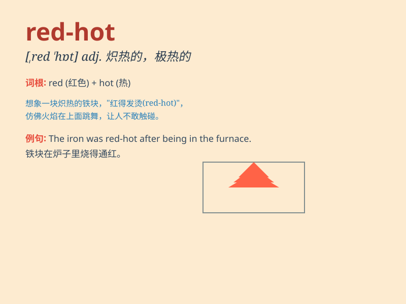

## red-hot

**英音:** _[ˌredˈhɒt]_ **美音:** _[ˌredˈhɑːt]_

**译义:** *adj.炽热的；极其激烈的；最新的；非常性感的*

### 短语

+ **red-hot news:** _最新的热门新闻_

+ **red-hot competition:** _激烈的竞争_

+ **red-hot market:** _炽热的市场_

+ **red-hot anger:** _极度的愤怒_

+ **red-hot tip:** _热门的建议_

### 例句

#### 例句1

> **The red-hot poker was burning in the fireplace.**

**中文翻译:** 炽热的拨火棍在壁炉里燃烧着。

**单词释义:** 炽热的

#### 例句2

> **The market for that product is red-hot right now.**

**中文翻译:** 那个产品的市场现在非常火爆。

**单词释义:** 非常热门的；火爆的

#### 例句3

> **She has a red-hot temper and gets angry easily.**

**中文翻译:** 她脾气暴躁，很容易生气。

**单词释义:** 暴躁的

### 背诵小故事

> There was a race. A car with a red-hot engine zoomed past. It was so
fast and powerful, like a burning flame. Everyone was amazed by its
red-hot performance.

**有一场比赛。一辆发动机炽热的汽车疾驰而过。它速度极快且动力强大，就像燃烧的火焰。每个人都对它炽热的表现感到惊讶。**

### 图义

