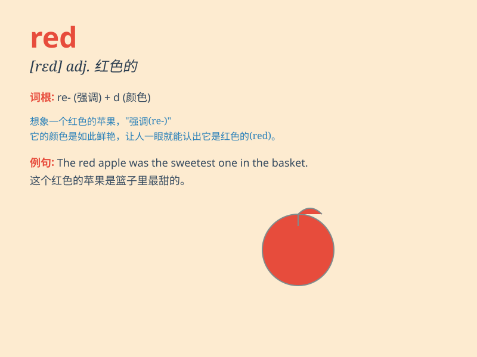

## red

**英音:** _[red]_ **美音:** _[rɛd]_

**译义:** *n.红色,红衣服,红颜料,赤字,亏空adj.红(色)的,革命的*

### 短语

+ **red wine:** _红葡萄酒_

+ **red flag:** _红旗；危险信号_

+ **red carpet:** _红地毯_

+ **in the red:** _负债；亏损_

+ **red alert:** _紧急警报_

### 例句

#### 例句1

> **The rose is red.**

**中文翻译:** 玫瑰是红色的。

**单词释义:** 红色的

#### 例句2

> **She turned red with anger.**

**中文翻译:** 她气得满脸通红。

**单词释义:** 变红；发红

#### 例句3

> **He saw a red car passing by.**

**中文翻译:** 他看到一辆红色汽车驶过。

**单词释义:** 红色的

### 背诵小故事

> A little girl was drawing. She chose a crayon called\'red\' to color
the apple. The bright red color made the apple look so delicious. Now,
you know\'red\' means a bright and strong color like this.

**一个小女孩正在画画。她选了一支叫做"红色"的蜡笔给苹果上色。鲜艳的红色让苹果看起来非常可口。现在，你知道"red"指的就是像这样鲜艳强烈的颜色。**

### 图义

