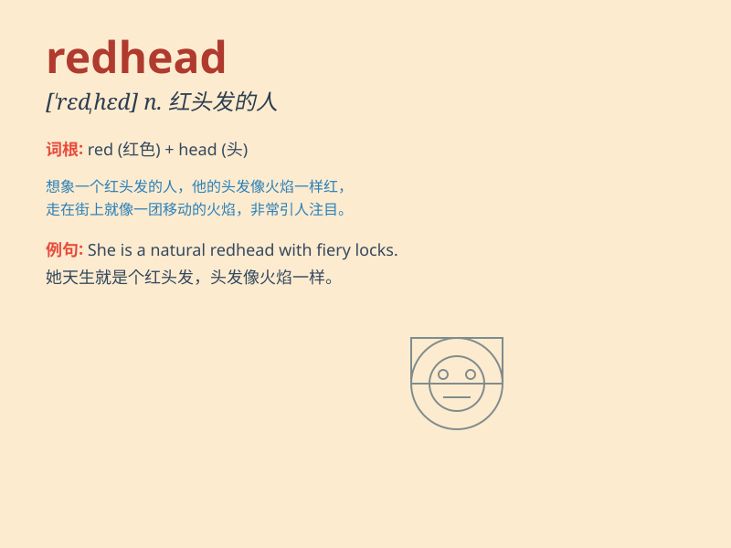

## redhead

**英音:** _[\'redhed]_ **美音:** _[\'rɛd\'hɛd]_

**译义:** *n.红发的人*

### 短语

+ **redhead duck:** _赤嘴潜鸭_

+ **redhead beauty:** _红发美女_

+ **redhead boy:** _红发男孩_

+ **redhead girl:** _红发女孩_

+ **lovely redhead:** _可爱的红发人_

### 例句

#### 例句1

> **The redhead girl in the class is very friendly.**

**中文翻译:** 班上的红发女孩非常友善。

**单词释义:** 红发的

#### 例句2

> **I saw a redhead walking along the street.**

**中文翻译:** 我看见一个红头发的人在街上走。

**单词释义:** 红发的

#### 例句3

> **The redhead actress gave an excellent performance.**

**中文翻译:** 这位红发女演员的表演非常出色。

**单词释义:** 红发的

### 背诵小故事

> Once upon a time, there was a girl with fiery red hair. Everyone
called her Redhead. She stood out in the crowd with her unique look. One
day, she found a lost puppy and her kindness shone through.

**从前，有一个女孩，有着火红的头发。大家都叫她红发女孩。她因其独特的外表在人群中很突出。有一天，她发现了一只走失的小狗，她的善良也随之展现。**

### 图义

