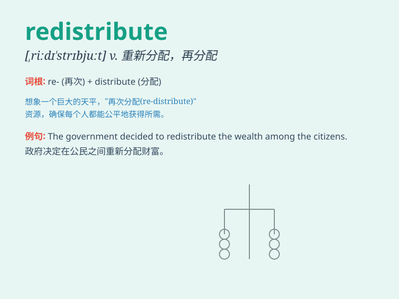

## redistribute

**英音:** _[,riːdɪ\'strɪbjuːt; riː\'dɪs-]_ **美音:**
_[,ridɪ\'strɪbjut]_

**译义:** *vt.重新分配,再区分,重新分布*

### 短语

+ **redistribute resources:** _重新分配资源_

+ **redistribute wealth:** _重新分配财富_

+ **redistribute power:** _重新分配权力_

+ **redistribute land:** _重新分配土地_

+ **redistribute income:** _重新分配收入_

### 例句

#### 例句1

> **The government plans to redistribute wealth to reduce
poverty.**

**中文翻译:** 政府计划重新分配财富以减少贫困。

**单词释义:** 重新分配

#### 例句2

> **We need to redistribute the resources more evenly among the
departments.**

**中文翻译:** 我们需要在各部门之间更均匀地重新分配资源。

**单词释义:** 重新分配

#### 例句3

> **The company decided to redistribute the workload to improve
efficiency.**

**中文翻译:** 公司决定重新分配工作量以提高效率。

**单词释义:** 重新分配

### 背诵小故事

> In a magical land, resources were wrongly distributed. But a wise
wizard decided to redistribute them fairly. He carefully planned and
made sure everyone got what they needed. Thus, \'redistribute\' means to
distribute again in a new way.

**在一个神奇的国度，资源分配不当。但一位睿智的巫师决定重新公平分配它们。他精心计划，确保每个人都得到所需。因此，\'redistribute\'意思是以新的方式再次分配。**

### 图义

