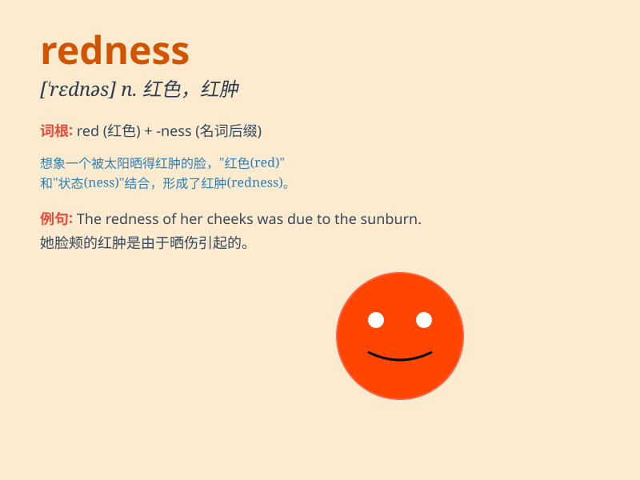

## redness

**英音:** _[\'rednɪs]_ **美音:** _[\'rɛdnɪs]_

**译义:** *n.红,红色*

### 短语

+ **skin redness:** _皮肤发红_

+ **facial redness:** _面部泛红_

+ **redness of the eyes:** _眼睛发红_

+ **reduce redness:** _减轻发红_

+ **treat redness:** _治疗发红_

### 例句

#### 例句1

> **The redness of her face indicated that she was embarrassed.**

**中文翻译:** 她脸色通红，说明她很尴尬。

**单词释义:** 脸红；发红

#### 例句2

> **The doctor examined the redness on his skin.**

**中文翻译:** 医生检查了他皮肤上的发红情况。

**单词释义:** 发红；发红的症状

#### 例句3

> **The redness around the wound suggested an infection.**

**中文翻译:** 伤口周围发红表明有感染。

**单词释义:** 发红；发红的区域

### 背诵小故事

> One day, a little girl was painting. She mixed a lot of red paint and
got her hands all covered. Her mom said, \'Look at the redness on your
hands!\' The girl understood that redness means the state of being red.

**有一天，一个小女孩在画画。她混合了很多红色颜料，双手都沾满了。她妈妈说：'看看你手上的红色！'小女孩明白了
redness 就是红色的状态。**

### 图义

