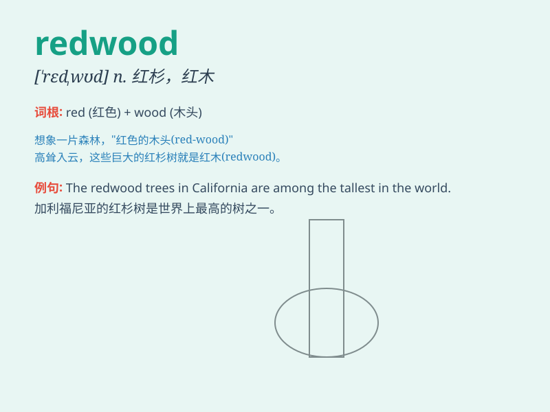

## redwood

**英音:** _[\'redwʊd]_ **美音:** _[\'rɛdwʊd]_

**译义:** *n.\<美>[植]红杉,红木树,红木树的木材*

### 短语

+ **redwood tree:** _红杉树_

+ **redwood forest:** _红杉林_

+ **giant redwood:** _巨型红杉_

+ **old-growth redwood:** _原始红杉_

+ **coast redwood:** _海岸红杉_

### 例句

#### 例句1

> **The redwood forest is a magnificent sight.**

**中文翻译:** 红杉林景色十分壮丽。

**单词释义:** 红杉树

#### 例句2

> **The old house was built with redwood.**

**中文翻译:** 老房子是用红木建造的。

**单词释义:** 红杉木材

#### 例句3

> **We went hiking in the redwood grove.**

**中文翻译:** 我们去红杉树林里徒步旅行。

**单词释义:** 红杉树

### 背诵小故事

> A little bear was lost in the forest. He saw a huge redwood tree and
decided to rest under it. The redwood\'s red bark and tall trunk made it
stand out. The bear felt safe and found his way home thanks to the
redwood.

**一只小熊在森林里迷路了。他看到一棵巨大的红杉树，决定在它下面休息。红杉树红色的树皮和高大的树干很显眼。小熊因为这棵红杉感到安全，并找到了回家的路。**

### 图义

