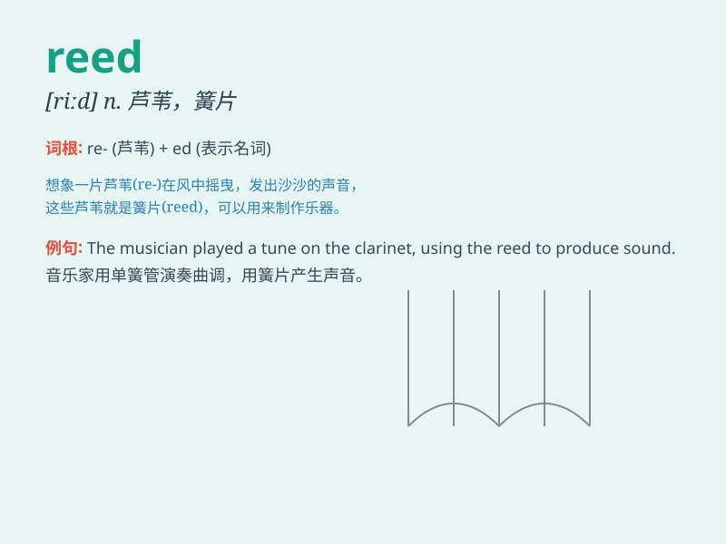

## reed

**英音:** _[riːd]_ **美音:** _[rid]_

**译义:** *n.芦苇,芦笛,簧片,管乐器*

### 短语

+ **reed pipe:** _芦笛_

+ **reed bed:** _芦苇床_

+ **reed warbler:** _苇莺_

+ **reed mace:** _香蒲_

+ **reed grass:** _芦苇草_

### 例句

#### 例句1

> **The wind blew through the reeds by the river.**

**中文翻译:** 风吹过河边的芦苇丛。

**单词释义:** 芦苇

#### 例句2

> **He cut a reed to make a simple flute.**

**中文翻译:** 他砍了一根芦苇，制作了一支简单的笛子。

**单词释义:** 芦苇

#### 例句3

> **The bird nested among the tall reeds.**

**中文翻译:** 那只鸟在高高的芦苇丛中筑巢。

**单词释义:** 芦苇

### 背诵小故事

> A little bird was lost in the wild. It needed a safe place to rest.
Finally, it found a thick reed. The reed was strong and tall, protecting
the bird from the wind. The bird felt so relieved.

**一只小鸟在野外迷路了。它需要一个安全的地方休息。最后，它找到了一丛茂密的芦苇。芦苇又粗又高，为小鸟挡住了风。小鸟感到很安心。**

### 图义

