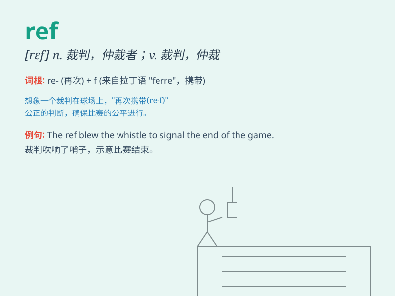

## ref

**英音:** _[ref]_ **美音:** _[rɛf]_

**译义:** *n.裁判员*

### 短语

+ **referee:** _裁判员；仲裁人_

+ **reference book:** _参考书_

+ **in reference to:** _关于；就......而论_

+ **with reference to:** _关于；有关_

+ **make reference to:** _提及；参考_

### 例句

#### 例句1

> **The referee blew the whistle to start the game.**

**中文翻译:** 裁判吹响了比赛开始的哨声。

**单词释义:** 裁判

#### 例句2

> **Please refer to the manual for instructions.**

**中文翻译:** 请参阅手册以获取说明。

**单词释义:** 参考；查阅

#### 例句3

> **He made a ref to his childhood in the speech.**

**中文翻译:** 他在演讲中提到了自己的童年。

**单词释义:** 提到；提及

### 背诵小故事

> A referee was very tired after a long football game. He needed to
refer to the rules to make a fair judgment. Finally, he made the right
call and everyone respected him.

**一位裁判在一场漫长的足球比赛后非常疲惫。他需要参考规则来做出公平的裁决。最后，他做出了正确的判罚，每个人都尊重他。**

### 图义

