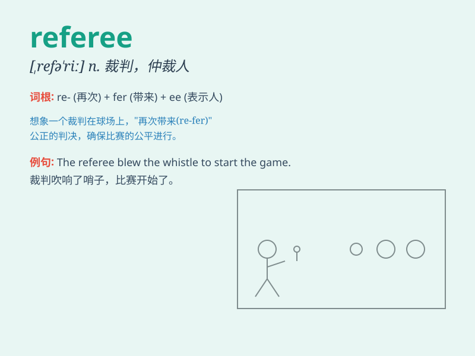

## referee

**英音:** _[refə\'riː]_ **美音:** _[,rɛfə\'ri]_

**译义:** *n.仲裁人,调解人,[体]裁判员v.仲裁,裁判*

### 短语

+ **referee report:** _裁判报告_

+ **chief referee:** _主裁判_

+ **assistant referee:** _助理裁判_

+ **referee decision:** _裁判决定_

+ **referee whistle:** _裁判哨子_

### 例句

#### 例句1

> **The referee blew the whistle to start the game.**

**中文翻译:** 裁判吹响了比赛开始的哨声。

**单词释义:** 裁判

#### 例句2

> **The players argued with the referee over the call.**

**中文翻译:** 球员们因判罚与裁判发生争执。

**单词释义:** 裁判

#### 例句3

> **The referee had to make a difficult decision during the
match.**

**中文翻译:** 比赛期间，裁判不得不做出一个艰难的决定。

**单词释义:** 裁判

### 背诵小故事

> In a football match, there was a lot of confusion. But the referee
was there to make fair decisions. He ran around, watched closely, and
ensured the game went smoothly. Remember, the referee is the one in
charge!

**在一场足球比赛中，场面很混乱。但裁判在那里做出公平的裁决。他跑来跑去，仔细观察，确保比赛顺利进行。记住，裁判就是那个负责掌控的人！**

### 图义

