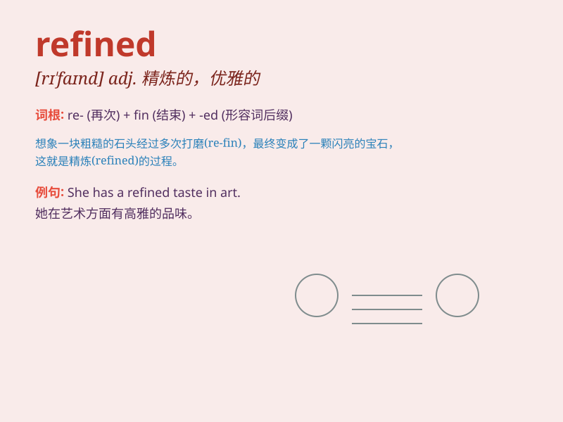

## refined

**英音:** _[rɪ\'faɪnd]_ **美音:** _[rɪ\'faɪnd]_

**译义:** *adj.精制的,优雅的,精确的*

### 短语

+ **refined sugar:** _精制糖_

+ **refined oil:** _精炼油_

+ **refined taste:** _高雅的品味_

+ **refined manner:** _优雅的举止_

+ **refined language:** _优美的语言_

### 例句

#### 例句1

> **She has a refined taste in art.**

**中文翻译:** 她对艺术有着高雅的品味。

**单词释义:** 高雅的；有教养的

#### 例句2

> **The refined oil is of high quality.**

**中文翻译:** 精炼出来的油品质量高。

**单词释义:** 精炼的；提纯的

#### 例句3

> **His refined manners made him popular at the party.**

**中文翻译:** 他优雅的举止使他在聚会上很受欢迎。

**单词释义:** 优雅的；有礼貌的

### 背诵小故事

> A young artist was creating rough paintings. But with time and
practice, he refined his skills. His works became more elegant and
precise, just like the word \'refined\' means made pure and improved.

**一位年轻的艺术家最初创作的画作很粗糙。但随着时间和练习，他改进了自己的技艺。他的作品变得更加优雅和精准，就像'refined'这个单词意味着变得纯净和改进。**

### 图义

