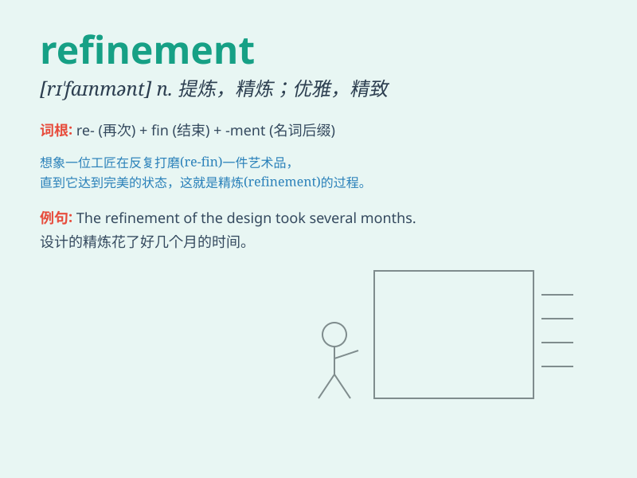

## refinement

**英音:** _[rɪ\'faɪnm(ə)nt]_ **美音:** _[rɪ\'faɪnmənt]_

**译义:** *n.精致,(言谈,举止等的)文雅,精巧*

### 短语

+ **refinement process:** _精炼过程；提纯过程_

+ **data refinement:** _数据精化；数据提炼_

+ **refinement stage:** _细化阶段；完善阶段_

+ **character refinement:** _性格修养；性格的完善_

+ **refinement technique:** _精炼技术；提纯技术_

### 例句

#### 例句1

> **The refinement of her writing skills was evident in her latest
novel.**

**中文翻译:** 她的写作技巧的提高在她最新的小说中得到了体现。

**单词释义:** 改进；完善

#### 例句2

> **The oil goes through several stages of refinement before it is
ready for use.**

**中文翻译:** 油在可供使用之前要经过几个阶段的精炼。

**单词释义:** 提炼；精炼

#### 例句3

> **His taste in art shows a great deal of refinement.**

**中文翻译:** 他的艺术品味表现出极大的精致。

**单词释义:** 修养；文雅

### 背诵小故事

> A poor artist was constantly working on his paintings, making small
changes and improvements. This process of making his art better was
called refinement. Finally, his refined works became famous.

**一位贫穷的艺术家一直在他的画作上努力，进行小的改动和完善。这个让他的艺术变得更好的过程被称为细化、改进。最终，他经过精心改进的作品出名了。**

### 图义

