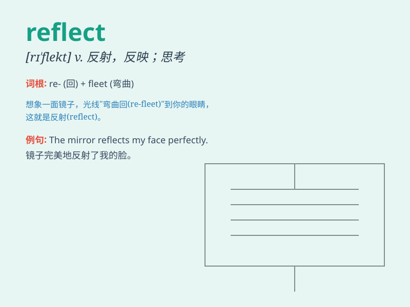

## reflect

**英音:** _[rɪ\'flekt]_ **美音:** _[rɪ\'flɛkt]_

**译义:** *v.反射,反映,表现,反省,细想*

### 短语

+ **reflect on:** _仔细考虑；反省；回想_

+ **reflect back:** _反射回来；反映_

+ **reflect upon:** _考虑；沉思；反思_

+ **be reflected in:** _反映在；体现在_

+ **reflect light:** _反射光_

### 例句

#### 例句1

> **The calm lake reflects the surrounding mountains.**

**中文翻译:** 平静的湖面倒映着周围的群山。

**单词释义:** 映出；反射

#### 例句2

> **Her work reflects her intelligence and creativity.**

**中文翻译:** 她的作品体现了她的智慧和创造力。

**单词释义:** 反映；表现

#### 例句3

> **He sat quietly, reflecting on his past mistakes.**

**中文翻译:** 他静静地坐着，反思自己过去的错误。

**单词释义:** 反思；思考

### 背诵小故事

> One day, when Tom looked into the mirror, he saw his own face. The
mirror reflected his appearance clearly. This made him think about how
his actions and words reflected his personality.

**一天，当汤姆看向镜子时，他看到了自己的脸。镜子清晰地反射出他的模样。这让他思考自己的言行如何反映出他的性格。**

### 图义

