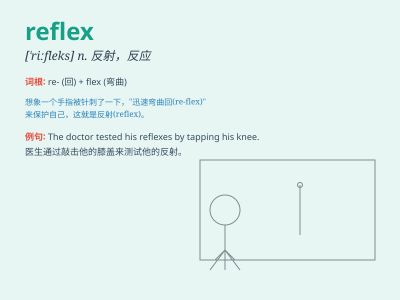

## reflex

**英音:** _[\'riːfleks]_ **美音:** _[\'riflɛks]_

**译义:** *adj.反射的,反省的,反作用的,优角的n.反射,反映,映象*

### 短语

+ **reflex action:** _反射动作_

+ **reflex arc:** _反射弧_

+ **reflex response:** _反射反应_

+ **knee-jerk reflex:** _膝跳反射_

+ **conditioned reflex:** _条件反射_

### 例句

#### 例句1

> **A knee-jerk reflex is an involuntary response.**

**中文翻译:** 下意识反射是一种不自觉的反应。

**单词释义:** 反射；反应

#### 例句2

> **His reflex action was to duck when he saw the ball coming towards
him.**

**中文翻译:** 当他看到球朝他飞来时，他的反射动作是躲开。

**单词释义:** 本能反应

#### 例句3

> **The reflex of the light on the water was blinding.**

**中文翻译:** 水面上的光线反射令人眼花缭乱。

**单词释义:** 反射（光、热、声音等）

### 背诵小故事

> One day, I was walking in the dark and suddenly a reflex made me jump
back. It was a reflex action when I saw a snake in front of me. My body
reacted automatically without thinking.

**有一天，我在黑暗中行走，突然一个反射动作让我向后跳。当我看到面前有条蛇时，这是一种反射行为。我的身体未经思考就自动做出了反应。**

### 图义

