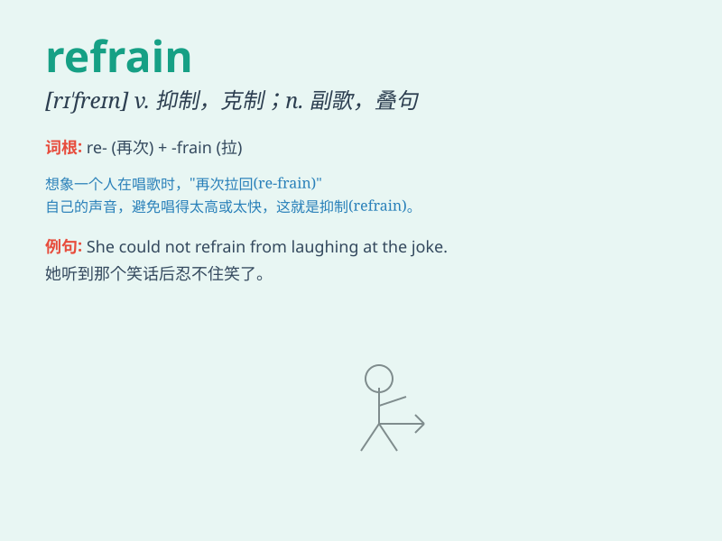

## refrain

**英音:** _[rɪ\'freɪn]_ **美音:** _[rɪ\'fren]_

**译义:** *n.重复,叠句,[乐]副歌vi.节制,避免,制止*

### 短语

+ **refrain from:** _忍住；抑制；戒除_

+ **constant refrain:** _不断重复的话语；常哼的曲调_

+ **moral refrain:** _道德劝诫_

+ **catchy refrain:** _动听的副歌；朗朗上口的重复段落_

+ **emotional refrain:** _情感上的克制_

### 例句

#### 例句1

> **Please refrain from smoking in the hospital.**

**中文翻译:** 请不要在医院内吸烟。

**单词释义:** 克制；抑制；避免

#### 例句2

> **She had to refrain from laughing at his jokes.**

**中文翻译:** 她不得不忍住，不要因为他的笑话而笑。

**单词释义:** 忍住；克制

#### 例句3

> **The government urged citizens to refrain from panic buying.**

**中文翻译:** 政府呼吁民众不要恐慌性抢购。

**单词释义:** 避免；制止

### 背诵小故事

> A little bird always wanted to sing a new song. But its mom told it
to refrain from doing that because it wasn\'t ready yet. So, the bird
held back and practiced more. Here, refrain means to hold back or stop
oneself from doing something.

**一只小鸟总是想唱新歌。但它的妈妈告诉它要克制，因为它还没准备好。于是，小鸟忍住了，继续更多练习。这里，refrain
意思是抑制、克制、忍住不做某事。**

### 图义

