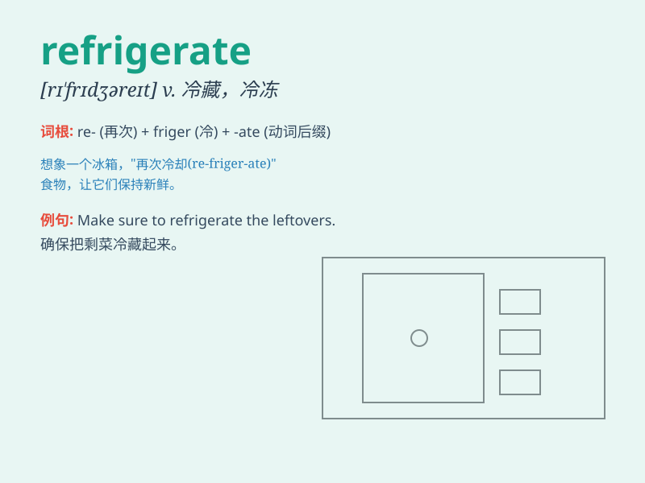

## refrigerate

**英音:** _[rɪ\'frɪdʒəreɪt]_ **美音:** _[rɪ\'frɪdʒəret]_

**译义:** *vt.使冷却,使变冷,使清凉,冷藏*

### 短语

+ **refrigerate food:** _冷藏食物_

+ **refrigerate drinks:** _冷藏饮料_

+ **refrigerate perishables:** _冷藏易腐物品_

+ **refrigerate overnight:** _冷藏过夜_

+ **refrigerate immediately:** _立即冷藏_

### 例句

#### 例句1

> **Please refrigerate the leftovers to keep them fresh.**

**中文翻译:** 请将剩菜冷藏以保持新鲜。

**单词释义:** 冷藏，冷冻

#### 例句2

> **The milk needs to be refrigerated immediately after opening.**

**中文翻译:** 牛奶开封后需要立即冷藏。

**单词释义:** 使冷却，使冷藏

#### 例句3

> **Do not refrigerate this medicine as it may lose its
effectiveness.**

**中文翻译:** 请勿冷藏该药物，因为它可能会失去其功效。

**单词释义:** 将\...放入冰箱

### 背诵小故事

> One hot summer day, I was so thirsty but the juice was warm. Then I
put it in the \'refrigerate\' box and waited. Soon, it became cold and
refreshing. Refrigerate means to make something cool and keep it that
way!

**在一个炎热的夏日，我很渴但果汁是温的。然后我把它放进"冷藏"箱里等着。很快，它变得又凉又清爽。refrigerate
意思是使某物冷却并保持那种状态！**

### 图义

