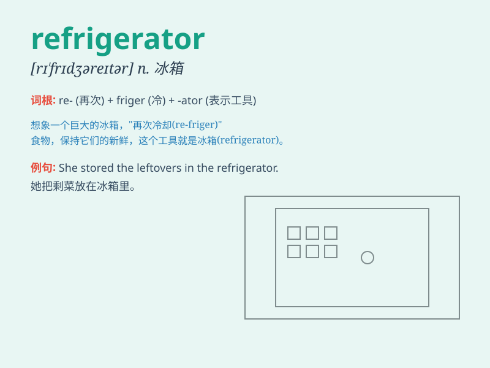

## refrigerator

**英音:** _[rɪ\'frɪdʒəreɪtə]_ **美音:**
_[rɪ\'frɪdʒəretɚ]_

**译义:** *n.电冰箱,冷藏库*

### 短语

+ **domestic refrigerator:** _家用冰箱_

+ **commercial refrigerator:** _商用冰箱_

+ **refrigerator compartment:** _冷藏室_

+ **refrigerator truck:** _冷藏车_

+ **refrigerator magnet:** _冰箱贴_

### 例句

#### 例句1

> **The refrigerator is out of order and needs to be repaired.**

**中文翻译:** 冰箱坏了，需要修理。

**单词释义:** 冰箱

#### 例句2

> **She opened the refrigerator to get some milk.**

**中文翻译:** 她打开冰箱去拿牛奶。

**单词释义:** 冰箱

#### 例句3

> **There is a lot of food in the refrigerator.**

**中文翻译:** 冰箱里有很多食物。

**单词释义:** 冰箱

### 背诵小故事

> One day, I was very thirsty and opened the refrigerator. To my
surprise, it was filled with all kinds of drinks and fruits. It was like
a magic box that kept everything cool and fresh.

**有一天，我非常口渴然后打开了冰箱。令我惊讶的是，里面装满了各种各样的饮料和水果。它就像一个神奇的盒子，能让所有东西保持凉爽和新鲜。**

### 图义

