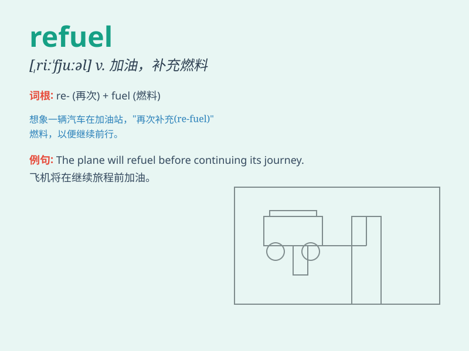

## refuel

**英音:** _[riː\'fjʊəl]_ **美音:** _[ri\'fjʊəl]_

**译义:** *v.补给燃料*

### 短语

+ **refuel station:** _加油站_

+ **refuel aircraft:** _给飞机加油_

+ **refuel quickly:** _快速加油_

+ **refuel frequently:** _频繁加油_

+ **refuel the car:** _给汽车加油_

### 例句

#### 例句1

> **The airplane needs to refuel before taking off again.**

**中文翻译:** 飞机再次起飞前需要加油。

**单词释义:** 加油

#### 例句2

> **We stopped at the gas station to refuel the car.**

**中文翻译:** 我们在加油站停下来给车加油。

**单词释义:** 给\...加油

#### 例句3

> **After a long journey, the driver decided to refuel his energy by
taking a nap.**

**中文翻译:** 经过长途跋涉，司机决定小憩一下补充体力。

**单词释义:** 补充（能量、精力等）

### 背诵小故事

> A plane was running out of fuel during a long flight. The pilot had
to land quickly and refuel. After refueling, the plane could continue
its journey safely.

**一架飞机在长途飞行中燃料即将耗尽。飞行员不得不迅速降落并补充燃料。加油后，飞机能够安全地继续其旅程。**

### 图义

