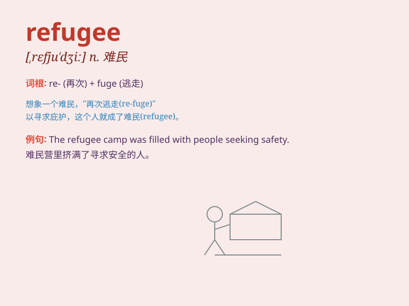

## refugee

**英音:** _[refjʊ\'dʒiː]_ **美音:** _[ˌrɛfjʊˈdʒi]_

**译义:** *n.难民,流亡者*

### 短语

+ **refugee camp:** _难民营_

+ **refugee crisis:** _难民危机_

+ **refugee flow:** _难民潮_

+ **refugee settlement:** _难民安置_

+ **refugee status:** _难民身份_

### 例句

#### 例句1

> **The refugee fled from the war-torn country.**

**中文翻译:** 难民逃离了饱受战争蹂躏的国家。

**单词释义:** 难民

#### 例句2

> **The government is providing aid to the refugees.**

**中文翻译:** 政府正在向难民提供援助。

**单词释义:** 难民

#### 例句3

> **The refugee camp was overcrowded and lacked basic amenities.**

**中文翻译:** 难民营人满为患，缺乏基本设施。

**单词释义:** 难民

### 背诵小故事

> A man was forced to leave his home due to war. He had nowhere to go
and became a refugee. He wandered and faced many difficulties, longing
for a safe place to live.

**一个男人因为战争被迫离开他的家。他无处可去，成为了一名难民。他四处流浪，面临诸多困难，渴望一个安全的生活之地。**

### 图义

