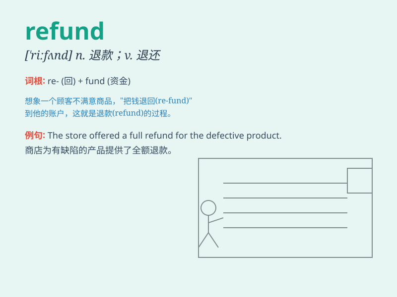

## refund

**英音:** _[ˈriːfʌnd]_ **美音:** _[ˈrifʌnd]_

**译义:** *v.退还,偿还n.归还,偿还额,退款*

### 短语

+ **refund policy:** _退款政策_

+ **refund money:** _退款_

+ **request a refund:** _要求退款_

+ **get a refund:** _得到退款_

+ **refund cheque:** _退款支票_

### 例句

#### 例句1

> **I requested a refund for the defective product.**

**中文翻译:** 我要求对有缺陷的产品进行退款。

**单词释义:** 退款

#### 例句2

> **The store promised to refund my money within three days.**

**中文翻译:** 店家承诺三天内退款。

**单词释义:** 退款

#### 例句3

> **If you\'re not satisfied, you can get a refund.**

**中文翻译:** 如果您不满意，您可以退款。

**单词释义:** 退款

### 背诵小故事

> A customer bought a pair of shoes but they were the wrong size. So,
the store agreed to refund the money. The customer was happy as the
refund process was smooth and quick.

**一位顾客买了一双鞋但尺码不对。于是，商店同意退款。顾客很高兴，因为退款过程顺利又迅速。**

### 图义

