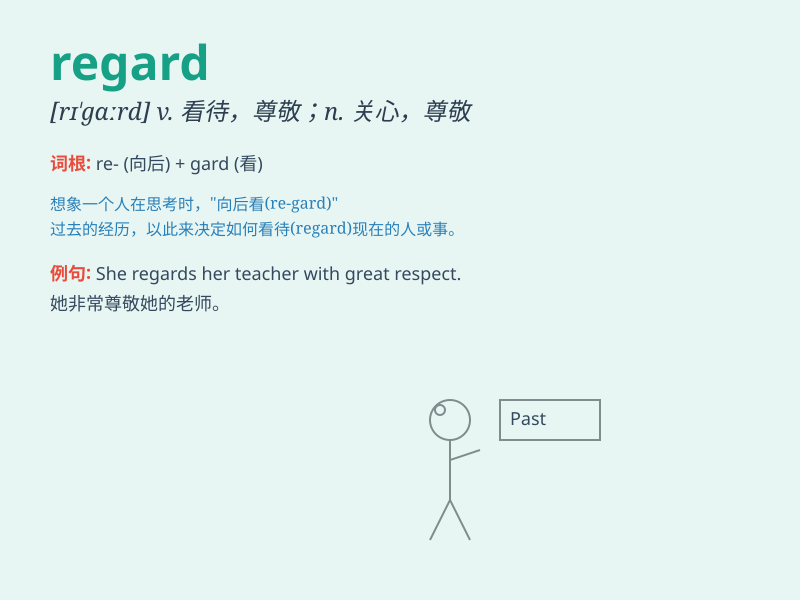

## regard

**英音:** _[rɪ\'gɑːd]_ **美音:** _[rɪ\'ɡɑrd]_

**译义:**
*n.关心,注意,尊敬,尊重,致意,问候,关系vt.看待,当作,重视,尊敬,关系*

### 短语

+ **in regard to:** _关于；至于_

+ **with regard to:** _关于；至于_

+ **regard as:** _把\...视为；认为\...是_

+ **pay regard to:** _重视；注意_

+ **have regard for:** _尊重；考虑到_

### 例句

#### 例句1

> **I regard him as my best friend.**

**中文翻译:** 我把他视为我最好的朋友。

**单词释义:** 把\...\...当作

#### 例句2

> **She regarded the situation with concern.**

**中文翻译:** 她关切地看待这一情况。

**单词释义:** 看待；注视

#### 例句3

> **In this regard, we need to take immediate action.**

**中文翻译:** 对此，我们需要立即采取行动。

**单词释义:** 方面

### 背诵小故事

> A king always regarded his loyal subjects with kindness. He carefully
considered their needs and thoughts. One day, a poor farmer came with a
problem, and the king gave it his full regard and found a solution.

**一位国王总是亲切地看待他忠诚的臣民。他仔细考虑他们的需求和想法。有一天，一个贫穷的农民带着问题前来，国王充分重视并找到了解决方案。**

### 图义

