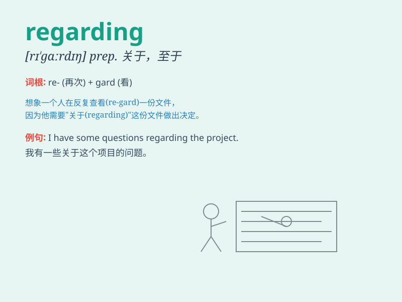

## regarding

**英音:** _[rɪ\'gɑːdɪŋ]_ **美音:** _[rɪ\'ɡɑrdɪŋ]_

**译义:** * prep.关于*

### 短语

+ **regarding as:** _把\...\...视为_

+ **in/with regard to:** _关于；至于_

+ **regarding of:** _关于_

+ **as regards:** _至于；关于_

+ **regarding something/someone:** _关于某事/某人_

### 例句

#### 例句1

> **Regarding your question, I need some time to think.**

**中文翻译:** 关于你的问题，我需要一些时间思考。

**单词释义:** 关于；至于

#### 例句2

> **He called to ask regarding the meeting.**

**中文翻译:** 他打电话询问会议有关情况。

**单词释义:** 有关；关于

#### 例句3

> **Regarding the job offer, she is still considering it.**

**中文翻译:** 对于这份工作，她还在考虑。

**单词释义:** 关于；在......方面

### 背诵小故事

> A detective was investigating a mystery. Regarding the strange clues,
he was very cautious. He thought hard, trying to solve the case.
Finally, he found the key regarding the mystery.

**一位侦探正在调查一个谜团。关于那些奇怪的线索，他非常谨慎。他努力思考，试图解开这个案子。最后，他找到了关于这个谜团的关键。**

### 图义

