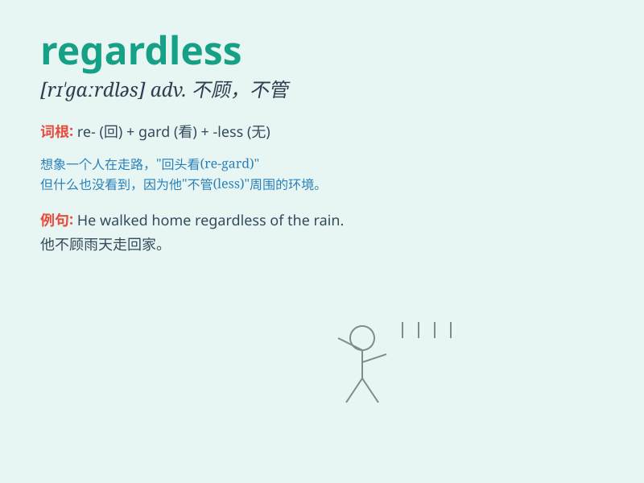

## regardless

**英音:** _[rɪ\'gɑːdlɪs]_ **美音:** _[rɪ\'ɡɑrdləs]_

**译义:** *adj.不管,不顾,不注意*

### 短语

+ **regardless of:** _不管；不顾；不理会_

+ **regardless whether:** _不论是否_

+ **be regardless:** _不顾；不管_

+ **act regardless:** _行事不顾后果_

+ **proceed regardless:** _不顾一切地进行_

### 例句

#### 例句1

> **He went ahead regardless of the danger.**

**中文翻译:** 他不顾危险，勇往直前。

**单词释义:** 不管；不顾

#### 例句2

> **Regardless of the outcome, we must try our best.**

**中文翻译:** 无论结果如何，我们都必须尽力而为。

**单词释义:** 不管；不论

#### 例句3

> **She is determined to do it regardless of what others say.**

**中文翻译:** 无论别人怎么说，她都决心要做到。

**单词释义:** 不顾；不理会

### 背诵小故事

> A brave adventurer was on a dangerous journey. Despite many
difficulties and warnings, he moved forward regardless. He didn\'t care
about the risks and was determined to reach his goal.

**一位勇敢的冒险家正在进行一次危险的旅程。尽管有许多困难和警告，他还是不顾一切地向前走。他不在乎风险，决心要达到自己的目标。**

### 图义

