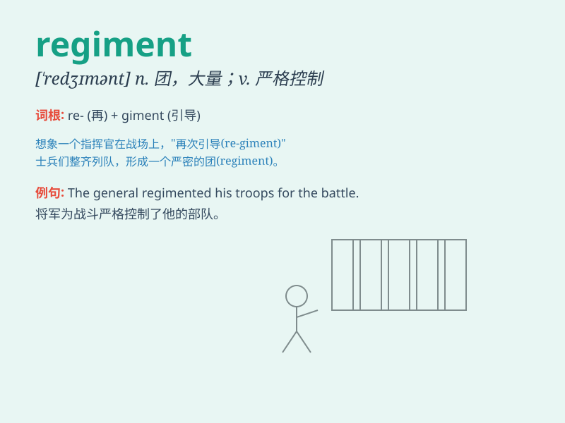

## regiment

**英音:** _[\'redʒɪm(ə)nt]_ **美音:** _[\'rɛdʒɪmənt]_

**译义:** *n.团,大群v.把\...编组,把\...编成团,管辖*

### 短语

+ **regiment commander:** _团指挥官_

+ **infantry regiment:** _步兵团_

+ **regiment training:** _团级训练_

+ **military regiment:** _军事团_

+ **regiment formation:** _团编队_

### 例句

#### 例句1

> **The regiment was deployed to the front line.**

**中文翻译:** 该团被部署到前线。

**单词释义:** 团；大量

#### 例句2

> **He was assigned to a new regiment.**

**中文翻译:** 他被分配到一个新团。

**单词释义:** 团

#### 例句3

> **The regiment of students marched in perfect formation.**

**中文翻译:** 学生们列队整齐地行进。

**单词释义:** 大量；群

### 背诵小故事

> A king commanded a regiment of soldiers to defend the castle. The
soldiers in the regiment were brave and united. They trained hard every
day to be ready for battle. Remember, regiment means a large group of
soldiers.

**一位国王命令一个团的士兵守卫城堡。这个团里的士兵勇敢且团结。他们每天刻苦训练，为战斗做好准备。记住，regiment
意思是（军队的）团。**

### 图义

