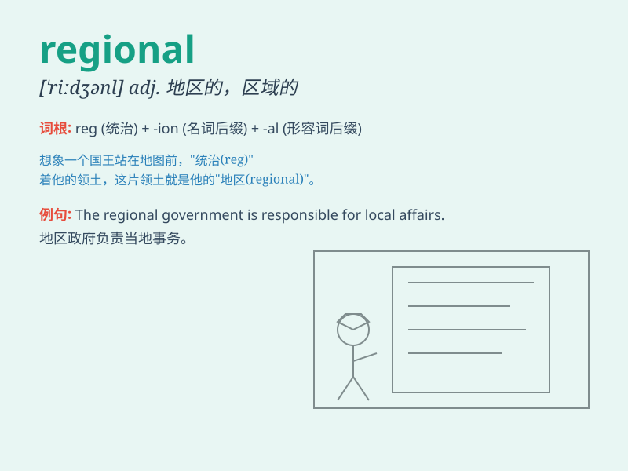

## regional

**英音:** _[\'riːdʒənl]_ **美音:** _[\'ridʒənl]_

**译义:** *adj.整个地区的,地方地,地域性地*

### 短语

+ **regional center:** _区域中心_

+ **regional development:** _区域发展_

+ **regional differences:** _地区差异_

+ **regional cuisine:** _地方美食；地方菜系_

+ **regional office:** _地区办事处_

### 例句

#### 例句1

> **The regional climate in this area is quite stable.**

**中文翻译:** 该地区区域气候相当稳定。

**单词释义:** 地区性的；局部的

#### 例句2

> **We need to study the regional differences in economic
development.**

**中文翻译:** 我们需要研究经济发展的区域差异。

**单词释义:** 地区的；区域的

#### 例句3

> **The regional manager is responsible for the sales in this
territory.**

**中文翻译:** 区域经理负责该区域的销售。

**单词释义:** 区域的；地区性的

### 背诵小故事

> Imagine a traveler lost in a big country. He finds different areas
with unique features. These areas are called regional. They have their
own customs and landscapes. So, regional means related to a particular
area.

**想象一位旅行者在一个大国迷路了。他发现不同的区域有着独特的特征。这些区域被称为
regional。它们有自己的风俗和景观。所以，regional
意思是与特定区域有关的。**

### 图义

