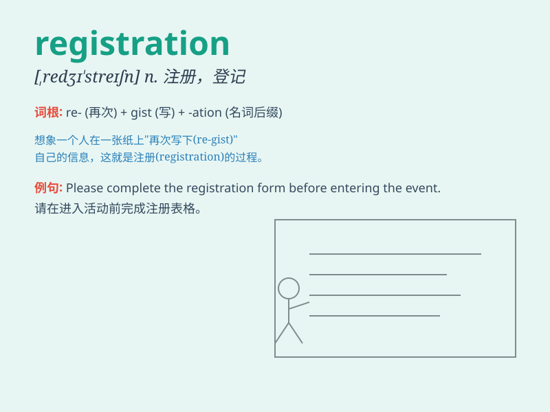

## registration

**英音:** _[redʒɪ\'streɪʃ(ə)n]_ **美音:**
_[\'rɛdʒɪ\'streʃən]_

**译义:** *n.注册,报到,登记*

### 短语

+ **registration form:** _登记表_

+ **registration fee:** _注册费；登记费_

+ **vehicle registration:** _车辆登记_

+ **registration number:** _登记号码；注册号码_

+ **registration certificate:** _登记证书；注册证书_

### 例句

#### 例句1

> **The registration process for the event is quite simple.**

**中文翻译:** 该活动的注册过程非常简单。

**单词释义:** 登记；注册

#### 例句2

> **You need to complete the registration form before you can start
the course.**

**中文翻译:** 您需要先填写注册表才能开始课程。

**单词释义:** 登记；注册

#### 例句3

> **The registration of the new car took a long time.**

**中文翻译:** 新车的注册花了很长时间。

**单词释义:** 登记

### 背诵小故事

> A group of friends went to a music festival. But before entering,
they needed registration. They lined up, gave their names and got
special wristbands. Finally, they happily enjoyed the festival.

**一群朋友去参加音乐节。但在进入之前，他们需要登记。他们排队，给出自己的名字并得到了特殊的腕带。最后，他们愉快地享受了音乐节。**

### 图义

