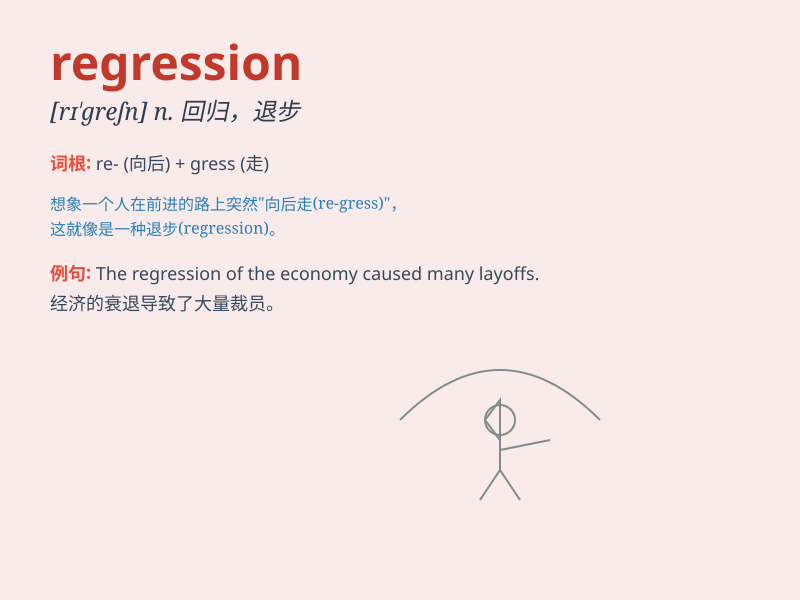

## regression

**英音:** _[rɪˈɡreʃn]_ **美音:** _[rɪˈɡreʃn]_

**译义:** *n.
回归，退回；退化，退步；（统计）回归分析；（计算机）回归测试*

### 短语

+ **linear regression:** _线性回归_

+ **multiple regression:** _多元回归_

+ **regression analysis:** _回归分析_

+ **logistic regression:** _逻辑回归_

+ **stepwise regression:** _逐步回归_

### 例句

#### 例句1

> **The company\'s profits showed a regression this year.**

**中文翻译:** 这家公司今年的利润出现了下降。

**单词释义:** 下降；衰退

#### 例句2

> **His performance at work has suffered a regression recently.**

**中文翻译:** 他最近在工作中的表现有所退步。

**单词释义:** 退步；倒退

#### 例句3

> **The patient\'s condition took a regression after the
treatment.**

**中文翻译:** 治疗后，病人的病情出现了恶化。

**单词释义:** 恶化；变坏

### 背诵小故事

> A scientist was studying a phenomenon. But as time went on, the data
showed a strange movement backward. It was like a regression to an
earlier state. The scientist was puzzled and worked hard to understand
this regression.

**一位科学家正在研究一种现象。但随着时间的推移，数据显示出一种奇怪的向后移动。这就像是退回到了更早的状态。这位科学家感到困惑，并努力去理解这种回归。**

### 图义

