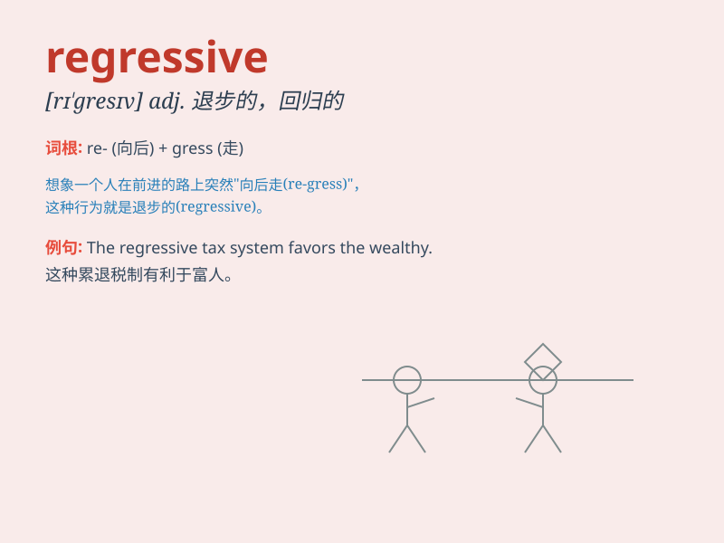

## regressive

**英音:** _[rɪ\'gresɪv]_ **美音:** _[rɪ\'ɡrɛsɪv]_

**译义:** *adj.回归的*

### 短语

+ **regressive tax:** _累退税_

+ **regressive behavior:** _倒退行为_

+ **regressive evolution:** _退行性进化_

+ **regressive policy:** _倒退的政策_

+ **regressive change:** _倒退的变化_

### 例句

#### 例句1

> **The new tax policy seems regressive as it burdens the
lower-income groups more.**

**中文翻译:**
新的税收政策似乎是倒退的，因为它给低收入群体带来了更大的负担。

**单词释义:** 倒退的；退化的

#### 例句2

> **His thinking on this matter is rather regressive and fails to
keep up with the times.**

**中文翻译:** 他在这件事上的想法相当落后，跟不上时代。

**单词释义:** 落后的

#### 例句3

> **The regressive measures adopted by the company led to a decline
in employee morale.**

**中文翻译:** 公司采取的退步措施导致员工士气下降。

**单词释义:** 退步的

### 背诵小故事

> A brave scientist was studying a mysterious disease. He found that
its development was regressive, like a time machine going backward. The
symptoms got better instead of worse. This strange phenomenon puzzled
him greatly.

**一位勇敢的科学家正在研究一种神秘的疾病。他发现其发展是倒退的，就像一台时光机在倒转。症状变好了而不是恶化了。这种奇怪的现象让他非常困惑。**

### 图义

