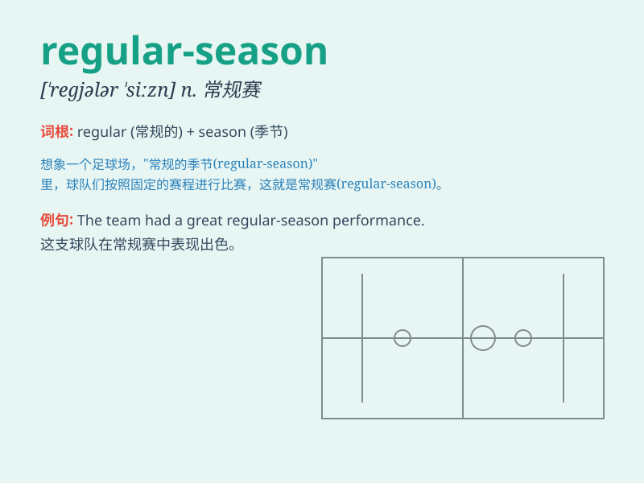

## regular-season

**英音:** _[ˈreɡjələr ˈsiːzn]_ **美音:** _[ˈreɡjələr
ˈsiːzn]_

**译义:** *n. 常规赛；常规赛季*

### 短语

+ **regular-season game:** _常规赛比赛_

+ **regular-season performance:** _常规赛表现_

+ **regular-season champion:** _常规赛冠军_

+ **regular-season schedule:** _常规赛赛程_

+ **regular-season record:** _常规赛纪录_

### 例句

#### 例句1

> **The team had an excellent performance in the regular-season.**

**中文翻译:** 这个团队在常规赛中表现出色。

**单词释义:** 常规赛的

#### 例句2

> **He was the top scorer of the regular-season game.**

**中文翻译:** 他是常规赛比赛中的最佳得分手。

**单词释义:** 常规赛的

#### 例句3

> **The regular-season schedule is very tight.**

**中文翻译:** 常规赛的赛程非常紧凑。

**单词释义:** 常规赛的

### 背诵小故事

> In the regular-season game, the team trained hard every day. They
followed a set schedule, played match after match. This regular routine
helped them perform well.

**在常规赛中，球队每天都刻苦训练。他们遵循固定的时间表，一场接一场地比赛。这种规律的日常安排帮助他们表现出色。**

### 图义

