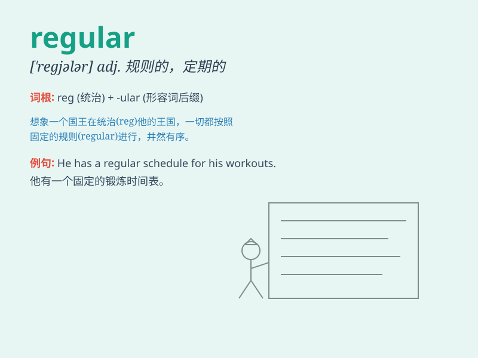

## regular

**英音:** _[\'regjʊlə]_ **美音:** _[\'rɛgjəlɚ]_

**译义:**
*adj.规则的,有秩序的,经常的,(花)整齐的,常备军的,等边的,合格的,定期的n.正规军,正式队员adv.经常地n.正常体*

### 短语

+ **regular customer:** _老顾客；常客_

+ **regular exercise:** _经常锻炼；定期运动_

+ **regular meeting:** _例会_

+ **regular income:** _固定收入；稳定收入_

+ **regular polygon:** _正多边形_

### 例句

#### 例句1

> **I try to do regular exercise to keep fit.**

**中文翻译:** 我努力定期锻炼以保持健康。

**单词释义:** 定期的

#### 例句2

> **He is a regular customer at this restaurant.**

**中文翻译:** 他是这家餐馆的常客。

**单词释义:** 经常的；常客

#### 例句3

> **The machine needs regular maintenance.**

**中文翻译:** 这台机器需要定期维护。

**单词释义:** 定期的

### 背诵小故事

> There was a regular soldier who always followed the rules precisely.
Every day, he woke up at the regular time, did regular exercises, and
wore his uniform in a regular way. His regularity made him a model in
the army.

**有一个常规的士兵，他总是精确地遵守规则。每天，他在固定的时间醒来，进行常规的锻炼，以常规的方式穿着制服。他的规律性使他成为军队中的模范。**

### 图义

