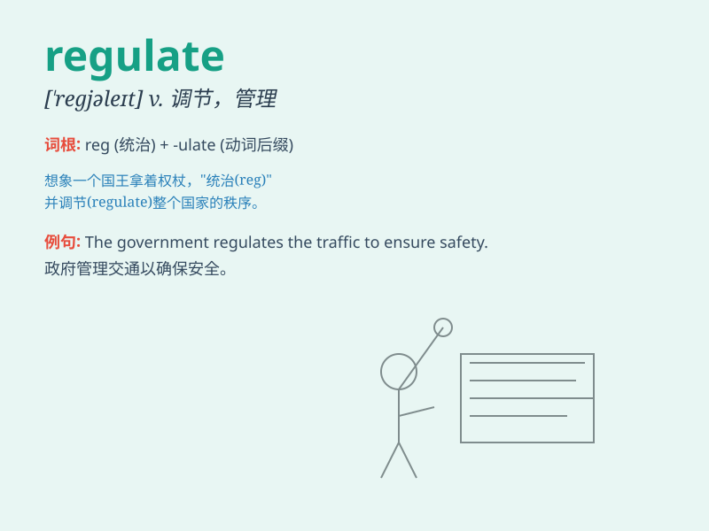

## regulate

**英音:** _[\'regjʊleɪt]_ **美音:** _[\'rɛɡjulet]_

**译义:** *vt.管制,控制,调节,校准*

### 短语

+ **regulate traffic:** _管制交通_

+ **regulate emotions:** _调节情绪_

+ **regulate the market:** _调控市场_

+ **regulate temperature:** _调节温度_

+ **regulate behavior:** _规范行为_

### 例句

#### 例句1

> **The government regulates the prices of essential goods to ensure
affordability for all.**

**中文翻译:** 政府调控基本商品的价格以确保所有人都能负担得起。

**单词释义:** 控制；管理；调节

#### 例句2

> **A thermostat regulates the temperature in the room.**

**中文翻译:** 恒温器调节房间里的温度。

**单词释义:** 调节；调整

#### 例句3

> **Laws regulate social behavior and maintain order.**

**中文翻译:** 法律规范社会行为并维持秩序。

**单词释义:** 规范；约束

### 背诵小故事

>
想象一个混乱的交通路口，车辆乱行。这时出现了一位超级警察，他制定规则，指挥交通，让一切变得有序。这位警察的行为就像\'regulate\'，意为规范、调节。

**想象一个混乱的交通路口，一位警察规范交通的行为就像\'regulate\'这个单词，意思是规范、调节。**

### 图义

