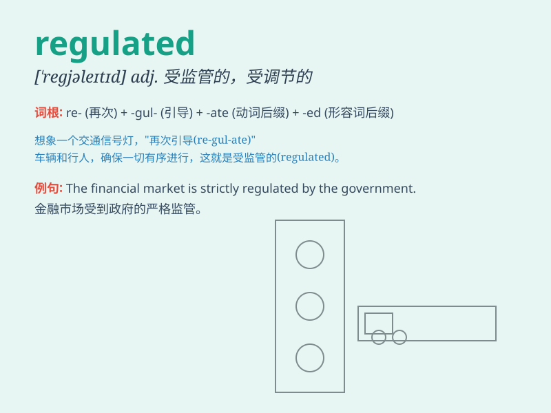

## regulated

**英音:** _[ˈregjʊleɪtɪd]_ **美音:** _[ˈreɡjəˌlātid]_

**译义:** *adj. 受管制的，被调节的；v.
调节，控制（regulate的过去式和过去分词）*

### 短语

+ **regulated market:** _受监管的市场_

+ **regulated industry:** _受监管的行业_

+ **regulated power supply:** _稳压电源_

+ **regulated environment:** _受监管的环境_

+ **regulated entity:** _受监管的实体_

### 例句

#### 例句1

> **The financial market is strictly regulated by the government.**

**中文翻译:** 金融市场受到政府的严格监管。

**单词释义:** 被监管；受到管制

#### 例句2

> **The speed of the vehicle should be regulated to avoid
accidents.**

**中文翻译:** 车辆的速度应该加以调节以避免事故。

**单词释义:** 调节；调整

#### 例句3

> **Her diet is carefully regulated to maintain good health.**

**中文翻译:** 她的饮食被精心调控以保持良好的健康状况。

**单词释义:** 控制；管理

### 背诵小故事

> A naughty monkey wanted to play in a factory but it was a regulated
area. Guards stopped the monkey and explained that rules must be
followed for safety. So, \'regulated\' means controlled by rules.

**一只顽皮的猴子想在一个工厂里玩耍，但那是一个受管制的区域。保安拦住了猴子并解释说为了安全必须遵守规则。所以，'regulated'意思是受规则控制。**

### 图义

