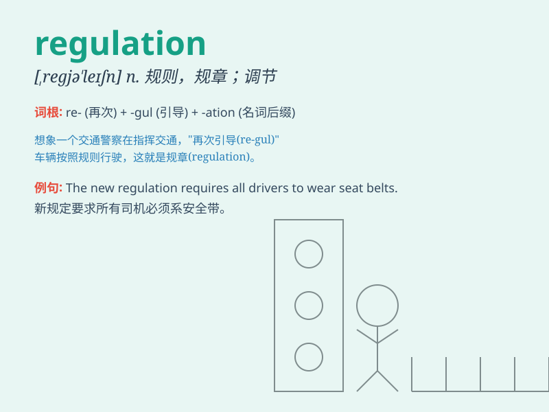

## regulation

**英音:** _[regjʊ\'leɪʃ(ə)n]_ **美音:** _[ˌrɛɡjəˈleʃən]_

**译义:** *n.规则,规章,调节,校准*

### 短语

+ **traffic regulation:** _交通规则_

+ **safety regulation:** _安全规则_

+ **regulatory framework:** _监管框架_

+ **regulatory authority:** _监管机构_

+ **regulatory compliance:** _合规性；遵守法规_

### 例句

#### 例句1

> **The new regulation aims to improve safety standards in the
workplace.**

**中文翻译:** 这项新规定旨在提高工作场所的安全标准。

**单词释义:** 规定；规则

#### 例句2

> **The company is in violation of financial regulations.**

**中文翻译:** 这家公司违反了金融法规。

**单词释义:** 法规；条例

#### 例句3

> **The regulation of traffic is very important for the smooth flow
of vehicles.**

**中文翻译:** 交通规则对于车辆的顺畅通行非常重要。

**单词释义:** 规则；规章

### 背诵小故事

> A naughty monkey always broke the rules in the zoo. The zookeeper
made new regulations to stop the monkey\'s bad behavior. With these
regulations, the monkey became well-behaved.

**一只顽皮的猴子总是在动物园里违反规则。动物园管理员制定了新的规定来阻止猴子的不良行为。有了这些规定，猴子变得守规矩了。**

### 图义

