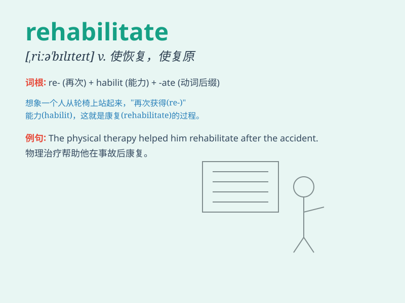

## rehabilitate

**英音:** _[ˌriːhəˈbɪlɪteɪt]_ **美音:**
_[ˌriːhəˈbɪlɪteɪt]_

**译义:** *v.使(身体)康复,使复职,使恢复名誉,使复原*

### 短语

+ **rehabilitate oneself:** _自我改造；自我恢复_

+ **rehabilitate criminals:** _改造罪犯_

+ **rehabilitate the environment:** _恢复环境_

+ **rehabilitate a reputation:** _恢复名誉_

+ **rehabilitate a building:** _修复建筑物_

### 例句

#### 例句1

> **The government is committed to rehabilitating the inner-city
areas.**

**中文翻译:** 政府致力于改造市中心区域。

**单词释义:** 改造；修复

#### 例句2

> **He was rehabilitated after serving his prison sentence.**

**中文翻译:** 他在服刑后得到了平反。

**单词释义:** 使恢复名誉；为...平反

#### 例句3

> **The doctor is trying to rehabilitate her injured knee.**

**中文翻译:** 医生正在努力使她受伤的膝盖康复。

**单词释义:** 使康复；使恢复正常生活

### 背诵小故事

> A criminal was down and out after prison. But with hard work and
support, he learned new skills, changed his mindset, and was
rehabilitated. Now he has a normal and happy life.

**一个罪犯出狱后穷困潦倒。但通过努力工作和外界支持，他学习了新技能，改变了心态，得以改造。现在他过上了正常幸福的生活。**

### 图义

