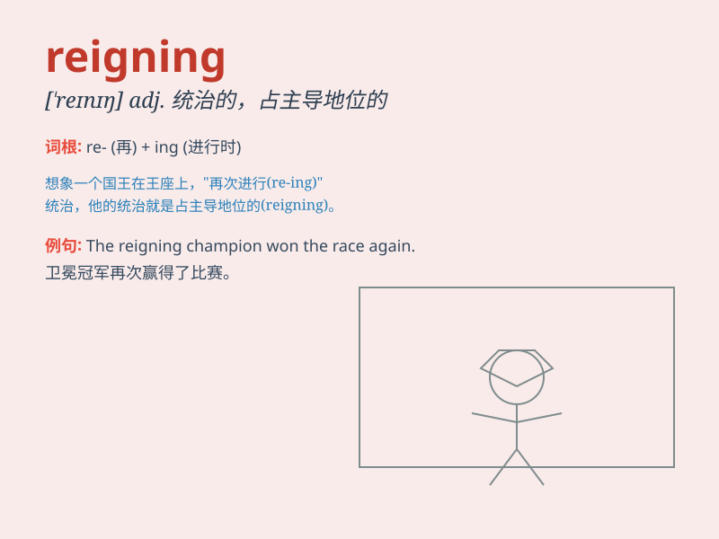

## reigning

**英音:** _[ˈreɪnɪŋ]_ **美音:** _[ˈreɪnɪŋ]_

**译义:** *adj.统治的,在位的,本届的,起支配作用的*

### 短语

+ **reigning champion:** _现任冠军_

+ **reigning monarch:** _在位君主_

+ **reigning power:** _统治权力_

+ **reigning ideology:** _主流意识形态_

+ **reigning beauty:** _当世美女_

### 例句

#### 例句1

> **The reigning champion successfully defended his title.**

**中文翻译:** 这位现任冠军成功地保住了他的头衔。

**单词释义:** 现任的；统治的；在位的

#### 例句2

> **She is the reigning beauty queen of the town.**

**中文翻译:** 她是该镇的现任选美皇后。

**单词释义:** 现任的；在位的

#### 例句3

> **The reigning ideology influences people\'s thoughts and
behaviors.**

**中文翻译:** 现行的意识形态影响着人们的思想和行为。

**单词释义:** 现行的；占统治地位的

### 背诵小故事

> The king was reigning over the kingdom with wisdom and kindness. His
reign brought peace and prosperity. People respected him for his just
decisions. Remember, \'reigning\' means being in power or ruling.

**国王以智慧和仁慈统治着王国。他的统治带来了和平与繁荣。人们因他公正的决策而尊敬他。记住，\'reigning\'意思是掌权或统治。**

### 图义

