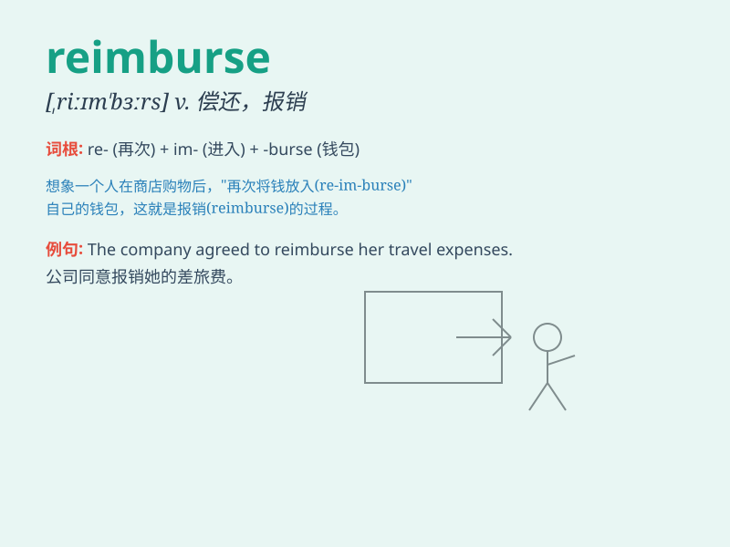

## reimburse

**英音:** _[,riːɪm\'bɜːs]_ **美音:** _[,riɪm\'bɝs]_

**译义:** *v.偿还*

### 短语

+ **reimburse expenses:** _报销费用_

+ **reimburse costs:** _偿还成本_

+ **reimburse losses:** _补偿损失_

+ **reimburse fully:** _全额报销_

+ **reimburse promptly:** _及时报销_

### 例句

#### 例句1

> **The company will reimburse you for your travel expenses.**

**中文翻译:** 公司将报销你的旅行费用。

**单词释义:** 报销

#### 例句2

> **I hope they reimburse me for the damaged goods.**

**中文翻译:** 我希望他们赔偿我损坏的货物。

**单词释义:** 赔偿

#### 例句3

> **The insurance company agreed to reimburse her medical costs.**

**中文翻译:** 保险公司同意偿付她的医疗费用。

**单词释义:** 偿付

### 背诵小故事

> A businessman lost his money on a trip. But the company promised to
reimburse him. They gave him the exact amount he spent, making him happy
again.

**一位商人在旅行中丢了钱。但公司承诺给他报销。他们给了他花掉的准确金额，让他再次开心起来。**

### 图义

