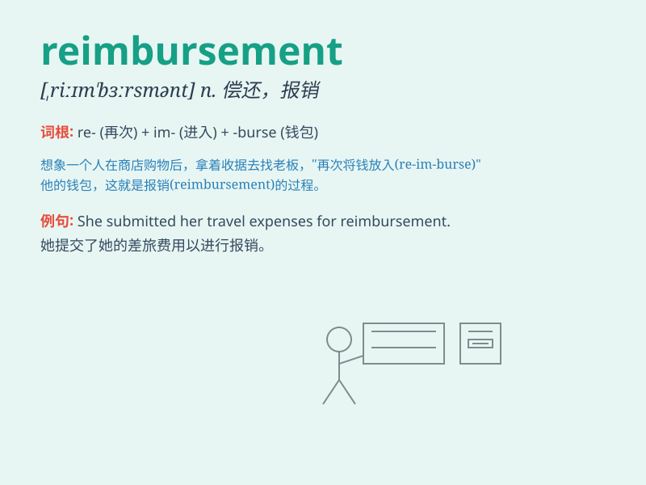

## reimbursement

**英音:** _[,ri:ɪm\'bɜ:smənt]_ **美音:**
_[,riɪm\'bɝsmənt]_

**译义:** *n.付还,退还*

### 短语

+ **reimbursement claim:** _报销申请_

+ **travel reimbursement:** _差旅报销_

+ **reimbursement policy:** _报销政策_

+ **reimbursement rate:** _报销率_

+ **reimbursement procedure:** _报销程序_

### 例句

#### 例句1

> **The company provided reimbursement for my travel expenses.**

**中文翻译:** 公司为我的差旅费提供了报销。

**单词释义:** 报销；偿还

#### 例句2

> **I am waiting for the reimbursement of my medical bills.**

**中文翻译:** 我正在等待我的医疗账单的报销。

**单词释义:** 报销；补偿

#### 例句3

> **The reimbursement process was quite complicated.**

**中文翻译:** 报销流程相当复杂。

**单词释义:** 报销；退款

### 背诵小故事

> A businessman was in a hurry to get a reimbursement for his travel
expenses. He submitted all the receipts and finally received the money.
The reimbursement made him happy and relieved his financial stress.

**一位商人急于拿到他的差旅费用报销。他提交了所有收据，最终收到了钱。这笔报销让他高兴，也缓解了他的财务压力。**

### 图义

