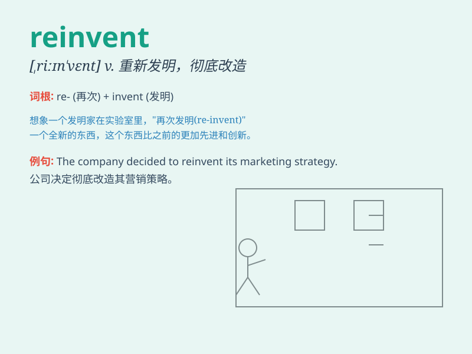

## reinvent

**英音:** _[ˌri:ɪnˈvent]_ **美音:** _[ˌriɪnˈvɛnt]_

**译义:**
*vt.(在不知他人以发明的情况下)从复发明,彻底改造,从新使用*

### 短语

+ **reinvent oneself:** _彻底改变自己；重塑自我_

+ **reinvent the wheel:** _重复发明；做无用功_

+ **reinvent something from scratch:** _从零开始重新创造某物_

+ **reinvent the business model:** _重塑商业模式_

+ **reinvent traditional methods:** _重新改造传统方法_

### 例句

#### 例句1

> **The company is trying to reinvent itself as a leader in
sustainable technology.**

**中文翻译:** 这家公司正试图将自身重塑为可持续技术领域的领导者。

**单词释义:** 重塑；彻底改造

#### 例句2

> **She reinvented her image with a new hairstyle and wardrobe.**

**中文翻译:** 她以新发型和新衣柜重塑了自己的形象。

**单词释义:** 重塑；彻底改变

#### 例句3

> **The chef has reinvented traditional dishes to create a unique
dining experience.**

**中文翻译:** 这位厨师重新打造了传统菜肴，以创造独特的用餐体验。

**单词释义:** 重新创造；彻底改造

### 背诵小故事

> A young entrepreneur was determined to reinvent the traditional
bookstore. He added coffee, comfy chairs, and events to make it a unique
place. Now, it\'s a favorite among locals. Reinvent means to create
something new and different.

**一位年轻的企业家决心彻底改造传统书店。他增添了咖啡、舒适的椅子和活动，使其成为一个独特的地方。现在，它成了当地人的最爱。reinvent
意思是彻底改造，创造新的不同的东西。**

### 图义

