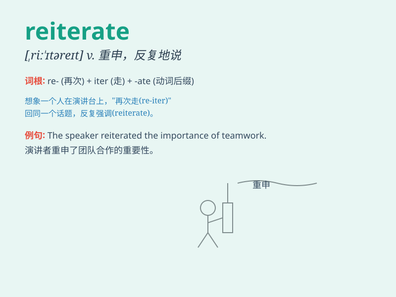

## reiterate

**英音:** _[riː\'ɪtəreɪt]_ **美音:** _[rɪ\'ɪtəret]_

**译义:** *vt.反复地说,重申,重做*

### 短语

+ **reiterate one\'s position:** _重申某人的立场_

+ **reiterate a demand:** _反复提出要求_

+ **reiterate an apology:** _再三道歉_

+ **reiterate a commitment:** _重申一项承诺_

+ **reiterate a point:** _反复强调某一点_

### 例句

#### 例句1

> **The teacher reiterated the importance of the exam.**

**中文翻译:** 老师一再强调考试的重要性。

**单词释义:** 反复地说；重申

#### 例句2

> **He reiterated his commitment to the project.**

**中文翻译:** 他再次表明对这个项目的承诺。

**单词释义:** 重复；反复声明

#### 例句3

> **The spokesperson reiterated the company\'s position on the
issue.**

**中文翻译:** 发言人重申了公司在这个问题上的立场。

**单词释义:** 反复讲；一再宣称

### 背诵小故事

> A king was giving a speech. But the crowd didn\'t seem to understand.
So, the king had to reiterate his words loudly and clearly. It means to
say something again and again for emphasis or clarity.

**一位国王正在发表演讲。但人群似乎不明白。于是，国王不得不大声且清晰地一再重复他的话。这个词意思是为了强调或清晰而反复地说某事。**

### 图义

