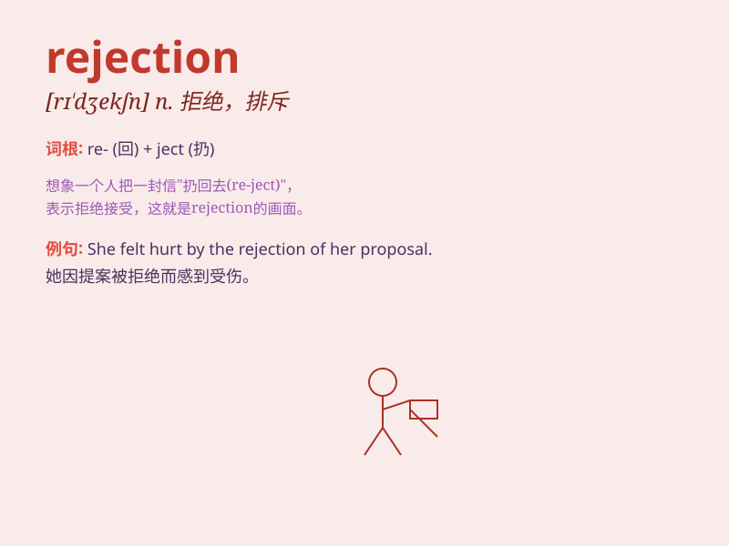

## rejection

**英音:** _[rɪ\'dʒekʃ(ə)n]_ **美音:** _[rɪ\'dʒɛkʃən]_

**译义:** *n.拒绝*

### 短语

+ **rejection letter:** _拒绝信_

+ **rejection rate:** _拒绝率_

+ **risk of rejection:** _被拒绝的风险_

+ **face rejection:** _面对拒绝_

+ **overcome rejection:** _克服拒绝_

### 例句

#### 例句1

> **Her rejection of his proposal was quite unexpected.**

**中文翻译:** 她拒绝他的求婚非常出乎意料。

**单词释义:** 拒绝

#### 例句2

> **The rejection of the manuscript by the publisher was a big blow
to the author.**

**中文翻译:** 出版商对稿件的驳回对作者是个重大打击。

**单词释义:** 驳回

#### 例句3

> **He couldn\'t handle the rejection from his dream school.**

**中文翻译:** 他无法应对来自理想学校的拒绝。

**单词释义:** 拒绝

### 背诵小故事

> A young artist submitted his paintings to a gallery, but received a
rejection. He was sad but didn\'t give up. Finally, his talent was
recognized. The word rejection means the act of refusing to accept
something or someone.

**一位年轻的艺术家向画廊提交了他的画作，但遭到了拒绝。他很伤心但没有放弃。最终，他的才华得到了认可。rejection
这个单词意为拒绝接受某物或某人的行为。**

### 图义

