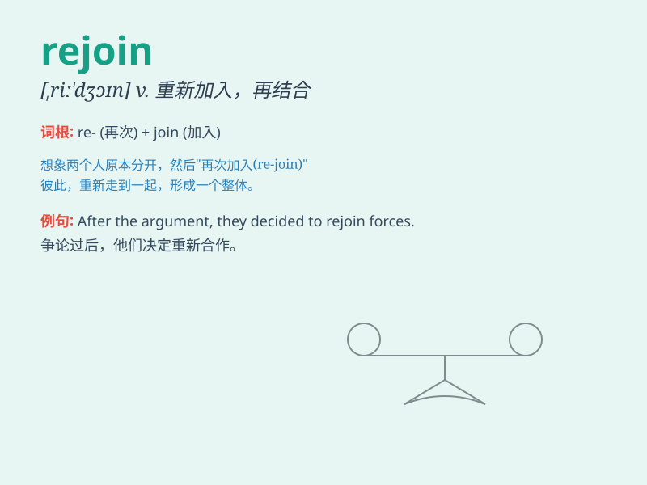

## rejoin

**英音:** _[riː\'dʒɒɪn]_ **美音:** _[,ri\'dʒɔɪn]_

**译义:** *vt.使再结合,再加入,再回答vi.重新聚集,回答,答辩*

### 短语

+ **rejoin the club:** _重新加入俱乐部_

+ **rejoin forces:** _重新联合；再次合作_

+ **rejoin the conversation:** _重新加入谈话_

+ **rejoin the family:** _重新回归家庭_

+ **rejoin the queue:** _重新排队_

### 例句

#### 例句1

> **He left the team but later decided to rejoin.**

**中文翻译:** 他离开了团队，但后来决定重新加入。

**单词释义:** 重新加入

#### 例句2

> **After a short break, she rejoin the conversation.**

**中文翻译:** 短暂休息后，她重新加入了谈话。

**单词释义:** 重新参与

#### 例句3

> **The path splits here but rejoin further on.**

**中文翻译:** 这条路在这里分开，但在更远处又重新汇合。

**单词释义:** 重新汇合

### 背诵小故事

> A brave soldier was separated from his team in the battle. But he
never gave up and finally found the way to rejoin them. With great joy,
they continued to fight together.

**一位勇敢的士兵在战斗中与他的队伍失散了。但他从未放弃，最终找到了重新加入他们的方法。带着巨大的喜悦，他们继续一起战斗。**

### 图义

