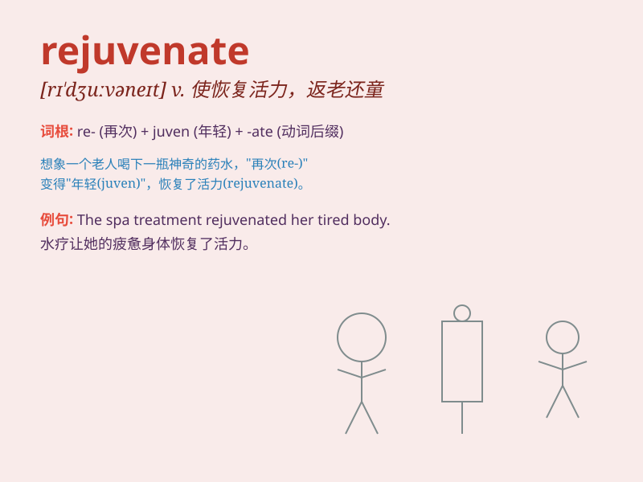

## rejuvenate

**英音:** _[rɪ\'dʒuːvəneɪt]_ **美音:** _[rɪ\'dʒuvənet]_

**译义:**
*vt.使年轻,使复原,使恢复精神,使恢复活力,使回春,使更新vi.返老还童,复原*

### 短语

+ **rejuvenate the economy:** _振兴经济_

+ **rejuvenate oneself:** _使自己恢复活力_

+ **rejuvenate the skin:** _使皮肤恢复活力_

+ **rejuvenate a city:** _使一个城市焕发生机_

+ **rejuvenate a relationship:** _恢复一段关系_

### 例句

#### 例句1

> **The spa treatment is designed to rejuvenate your skin.**

**中文翻译:** 这种水疗护理旨在使您的皮肤恢复活力。

**单词释义:** 使恢复活力

#### 例句2

> **Exercise and a healthy diet can rejuvenate your body and
mind.**

**中文翻译:** 运动和健康的饮食可以使你的身心恢复活力。

**单词释义:** 使恢复活力

#### 例句3

> **The new management team hopes to rejuvenate the struggling
company.**

**中文翻译:** 新的管理团队希望使这家陷入困境的公司恢复生机。

**单词释义:** 使恢复生机

### 背诵小故事

> A tired old tree was on the verge of dying. But with special magic,
it rejuvenated. New leaves grew, and its trunk became strong again. Just
like this tree, \'rejuvenate\' means to make something become young and
fresh again.

**一棵疲惫的老树濒临死亡。但通过特殊的魔法，它恢复了活力。新叶长出，树干再次变得强壮。就像这棵树一样，'rejuvenate'这个单词的意思是使某物重新变得年轻和有活力。**

### 图义

