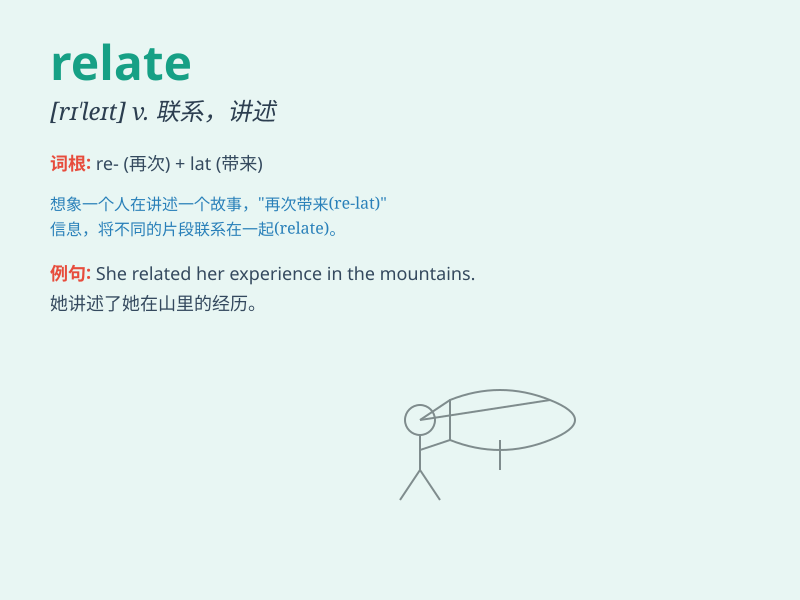

## relate

**英音:** _[rɪ\'leɪt]_ **美音:** _[rɪ\'let]_

**译义:** *vt.叙述,讲,使联系,发生关系*

### 短语

+ **relate to:** _涉及；与......有关_

+ **be related to:** _与......有关；和......有联系_

+ **relate with:** _使符合；与......相联系_

+ **relate sth. to sb.:** _向某人讲述某事_

+ **relate A to B:** _把 A 与 B 联系起来_

### 例句

#### 例句1

> **I find it difficult to relate to his strange ideas.**

**中文翻译:** 我觉得很难理解他那些奇怪的想法。

**单词释义:** 理解，认同

#### 例句2

> **She relates her childhood experiences in the book.**

**中文翻译:** 她在书中讲述了自己的童年经历。

**单词释义:** 讲述，叙述

#### 例句3

> **These two events are closely related.**

**中文翻译:** 这两件事密切相关。

**单词释义:** 有关联，相关

### 背诵小故事

> Once upon a time, a little girl tried to relate her funny day at
school to her parents. She shared every detail and they listened
carefully. Through this sharing, they understood and felt closer.

**从前，一个小女孩试图向她的父母讲述她在学校有趣的一天。她分享了每一个细节，他们认真倾听。通过这种分享，他们相互理解，感觉更亲近了。**

### 图义

