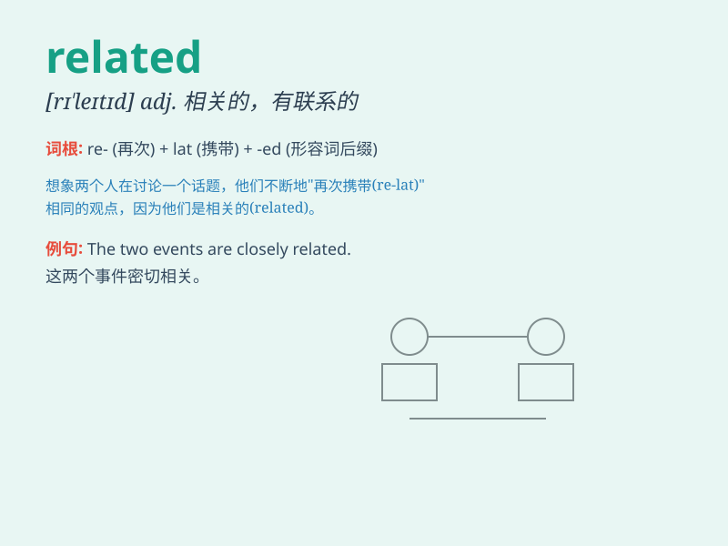

## related

**英音:** _[rɪ\'leɪtɪd]_ **美音:** _[rɪ\'letɪd]_

**译义:** *adj.叙述的,讲述的,有关系的*

### 短语

+ **be related to:** _与\...\...有关_

+ **related information:** _相关信息_

+ **related party:** _关联方_

+ **related field:** _相关领域_

+ **related product:** _相关产品_

### 例句

#### 例句1

> **These two events are closely related.**

**中文翻译:** 这两个事件密切相关。

**单词释义:** 相关的

#### 例句2

> **She is related to me by marriage.**

**中文翻译:** 她因为婚姻关系和我有关联。

**单词释义:** 有关系的

#### 例句3

> **The report is related to the company\'s financial situation.**

**中文翻译:** 这份报告与公司的财务状况有关。

**单词释义:** 与\...\...有关

### 背诵小故事

> A king has many relatives. They are all related to him by blood. But
some are kind, while others are not. The king must figure out who is
truly related to his heart.

**一位国王有许多亲戚。他们都和他有血缘关系。但有些人善良，而有些人则不然。国王必须弄清楚谁与他真心相关。**

### 图义

