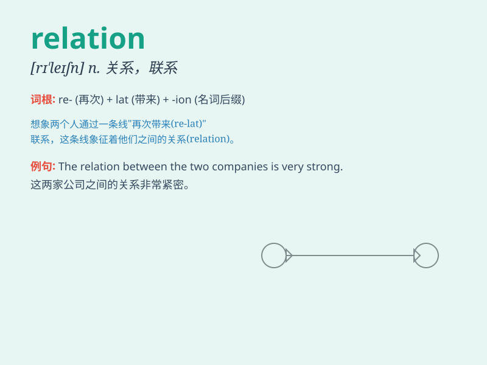

## relation

**英音:** _[rɪ\'leɪʃ(ə)n]_ **美音:** _[rɪ\'leʃən]_

**译义:** *n.关系,联系,叙述,故事,亲戚*

### 短语

+ **family relation:** _家庭关系_

+ **public relation:** _公共关系_

+ **blood relation:** _血缘关系_

+ **business relation:** _业务关系_

+ **diplomatic relation:** _外交关系_

### 例句

#### 例句1

> **The relation between the two countries has improved recently.**

**中文翻译:** 最近两国之间的关系有所改善。

**单词释义:** 关系

#### 例句2

> **I have no relation with that company.**

**中文翻译:** 我和那家公司没有关系。

**单词释义:** 关系；联系

#### 例句3

> **The book explores the complex relations among different social
classes.**

**中文翻译:** 这本书探讨了不同社会阶层之间复杂的关系。

**单词释义:** 关系；联系

### 背诵小故事

> A king had many relatives. But the relation between him and his
cousin was special. They shared secrets and supported each other. This
shows the meaning of connection and bond that \'relation\' implies.

**一位国王有许多亲属。但他和他表亲的关系很特别。他们分享秘密，互相支持。这体现了\'relation\'所包含的联系和纽带的意思。**

### 图义

