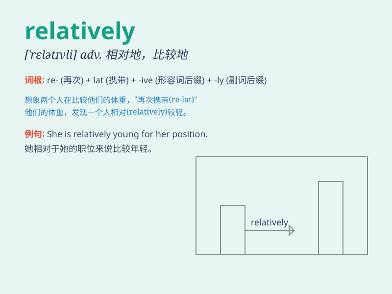

## relatively

**英音:** _[\'relətɪvlɪ]_ **美音:** _[\'rɛlətɪvli]_

**译义:** * 相关地*

### 短语

+ **relatively speaking:** _相对而言_

+ **relatively easy:** _相对容易_

+ **relatively small:** _相对较小_

+ **relatively new:** _相对较新_

+ **relatively few:** _相对较少_

### 例句

#### 例句1

> **Relatively speaking, this book is more interesting than that
one.**

**中文翻译:** 相对而言，这本书比那本更有趣。

**单词释义:** 相对地

#### 例句2

> **The new law is relatively easy to understand.**

**中文翻译:** 新法律相对容易理解。

**单词释义:** 相对地

#### 例句3

> **She is relatively unknown in the music industry.**

**中文翻译:** 她在音乐界相对来说默默无闻。

**单词释义:** 相对地

### 背诵小故事

> A small town was relatively peaceful compared to the big city. There
were fewer cars and less noise. People led a simple life. \'Relatively\'
here means in a way that is compared and shows a degree of difference.

**一个小镇与大城市相比相对平静。车更少，噪音也更小。人们过着简单的生活。这里的'relatively'意思是通过比较，表示一定程度的差异。**

### 图义

