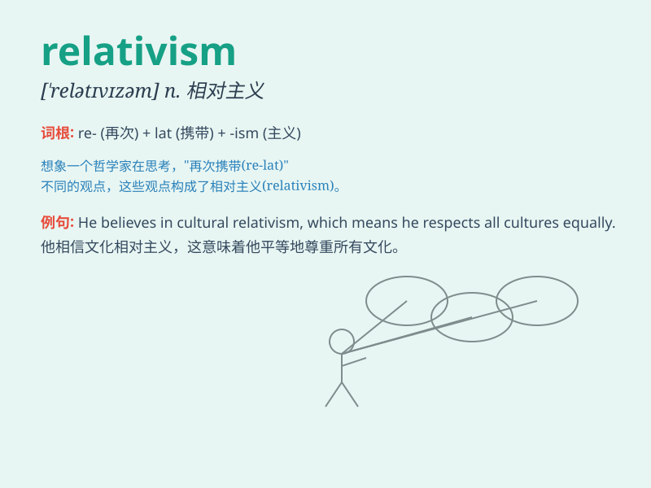

## relativism

**英音:** _[\'relətɪvɪz(ə)m]_ **美音:**
_[\'rɛlətɪvɪzəm]_

**译义:** *n.相对论,相对主义*

### 短语

+ **cultural relativism:** _文化相对主义_

+ **ethical relativism:** _伦理相对主义_

+ **moral relativism:** _道德相对主义_

+ **epistemological relativism:** _认识论相对主义_

+ **relativism of truth:** _真理的相对主义_

### 例句

#### 例句1

> **Relativism often leads to confusion in moral and ethical
discussions.**

**中文翻译:** 相对主义常常在道德和伦理讨论中导致混乱。

**单词释义:** 相对主义

#### 例句2

> **The philosopher criticized relativism for its lack of firm
principles.**

**中文翻译:** 这位哲学家批评相对主义缺乏坚定的原则。

**单词释义:** 相对主义

#### 例句3

> **Some people embrace relativism as a way to tolerate different
viewpoints.**

**中文翻译:** 一些人接受相对主义作为容忍不同观点的一种方式。

**单词释义:** 相对主义

### 背诵小故事

> One day, a philosopher was explaining relativism. He said imagine two
people seeing the same event but having different opinions. That\'s
relativism - everything is relative and depends on one\'s perspective.

**有一天，一位哲学家在解释相对主义。他说，想象两个人看到同一件事但有不同的看法。这就是相对主义------一切都是相对的，取决于个人的观点。**

### 图义

